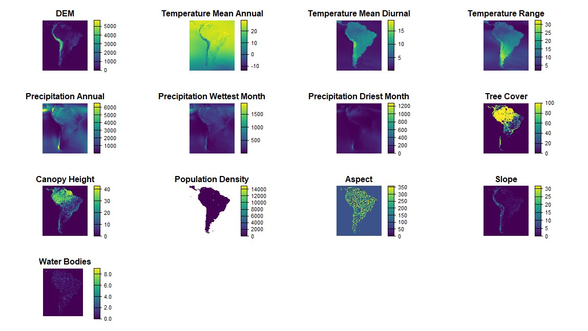
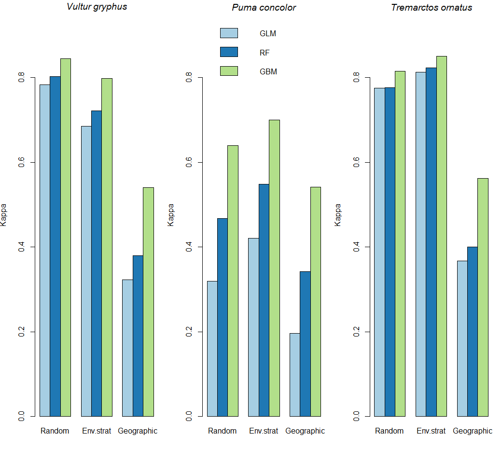
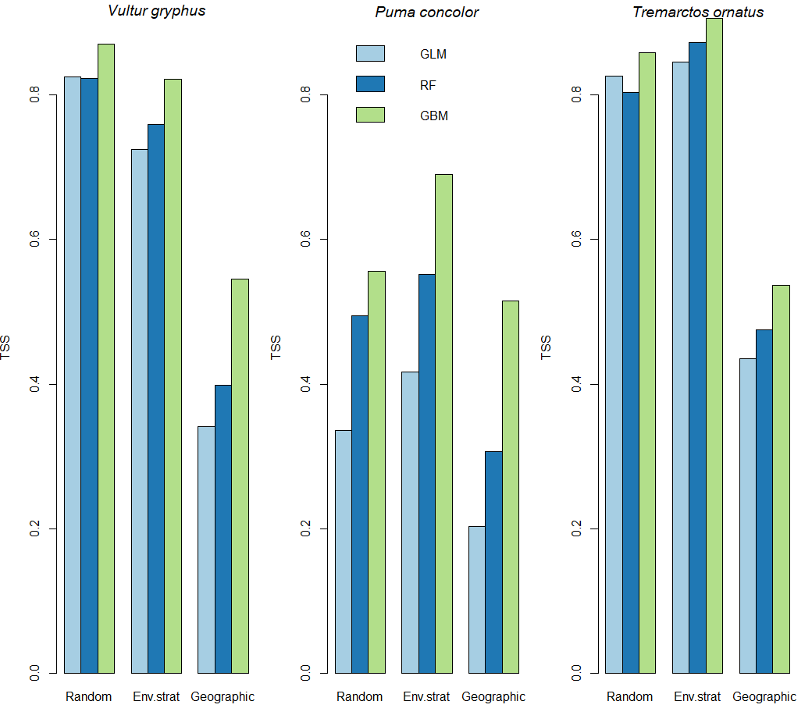
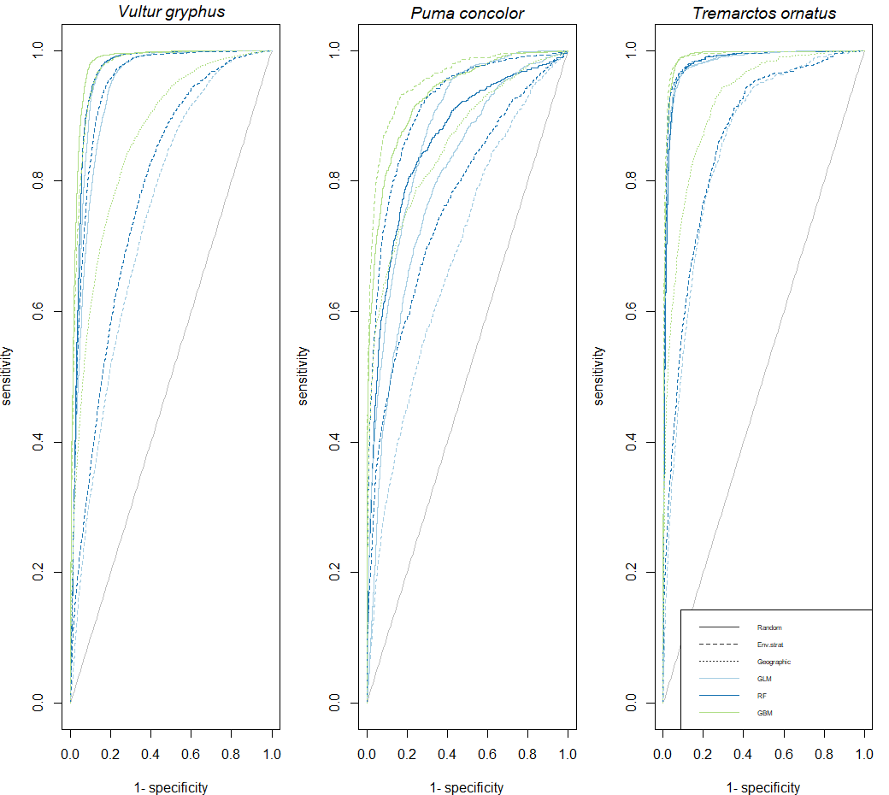
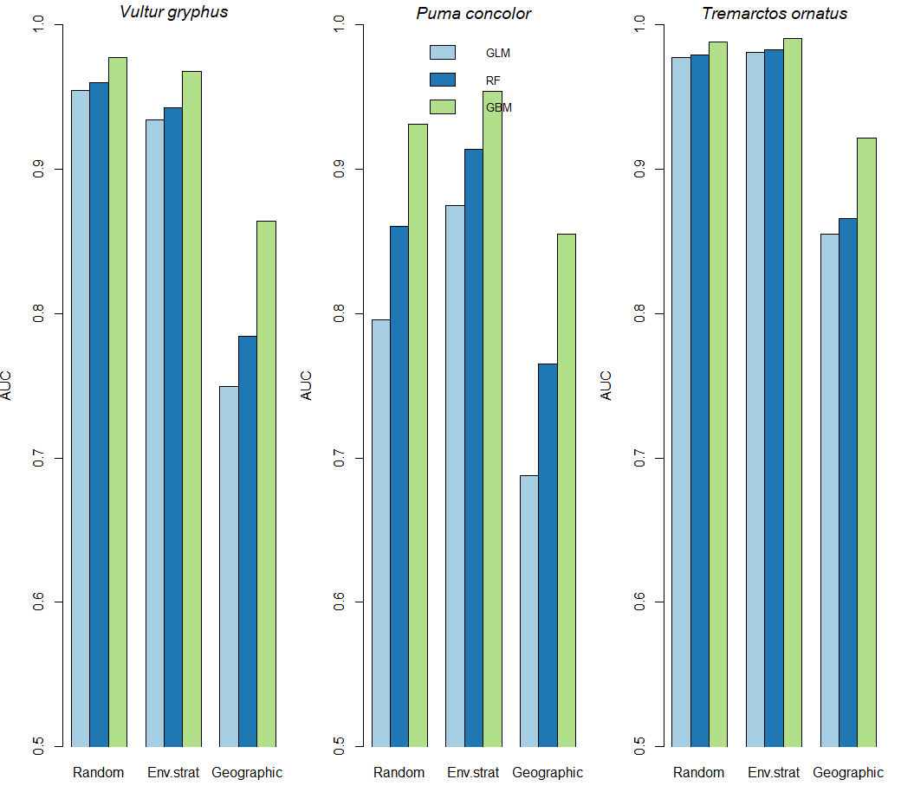
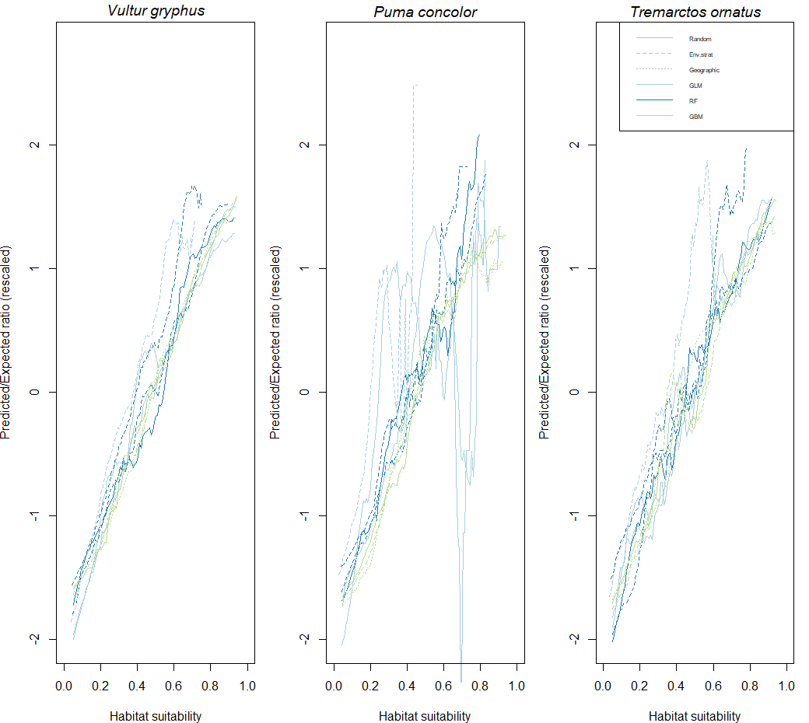

```{r setup, include=FALSE}
knitr::opts_chunk$set(echo = TRUE)
```

# Landscape Modelling Project - Condors

## Main Script

Students: Justine De Groote, Tanja Falasca, Manuel Weber

Supervisor: Monika K. Goralczyk

## Organization

Weekly meetings on Tuesdays at 4:15 PM on the green floor in CHN or in F77 (no meeting on the 11th of April).

Summarize and email questions to Monika before the meetings.

+-------------+--------------------------------------------------------------------------------------------+----------------------------------------------------------------------+
| Date        | Progress Milestone                                                                         | Suggested Focus                                                      |
+=============+============================================================================================+======================================================================+
| 03.04-07.04 | Species occurrence data downloaded and cleaned                                             | Data retrieval and cleaning                                          |
+-------------+--------------------------------------------------------------------------------------------+----------------------------------------------------------------------+
| 10.04-14.05 | Environmental data prepared for model fitting                                              | Environmental exploration                                            |
+-------------+--------------------------------------------------------------------------------------------+----------------------------------------------------------------------+
| 17.04-21.04 | 1.Initial set of predictors selected 2.Created 1st set of PAs (e.g.: random)               | Environmental predictors ; Pseudoabsence creation (PAs)              |
+-------------+--------------------------------------------------------------------------------------------+----------------------------------------------------------------------+
| 24.04-28.04 | Buffered, target-group, environmentally stratified PAs                                     | Pseudoabsence creation (PAs)                                         |
+-------------+--------------------------------------------------------------------------------------------+----------------------------------------------------------------------+
| 01.05-05.05 | Models fitted and evaluated (at least 2 algorithms)                                        | Model fitting & evaluation                                           |
+-------------+--------------------------------------------------------------------------------------------+----------------------------------------------------------------------+
| 08.05-12.05 | Evidence of exploring different model parameters, selected ones with best fit and accuracy | Generated predictor response curves, model fitting & model selection |
+-------------+--------------------------------------------------------------------------------------------+----------------------------------------------------------------------+
| 15.05-19.05 | Creation of ranges (polygons for mammals)                                                  | Alternative approach to SDM                                          |
+-------------+--------------------------------------------------------------------------------------------+----------------------------------------------------------------------+
| 22.05-26.05 | Overlap of distributions and protected areas                                               | Implications for conservation                                        |
+-------------+--------------------------------------------------------------------------------------------+----------------------------------------------------------------------+
| 22.05       | Presentation                                                                               |                                                                      |
+-------------+--------------------------------------------------------------------------------------------+----------------------------------------------------------------------+

: Preliminary schedule

#### SDM resources

Zurell, D. et al. (2020) "A standard protocol for reporting species distribution models," Ecography, 43(9), pp. 1261--1277. Available at: <https://doi.org/10.1111/ecog.04960>

ENM2020 course (table 1 contains description of tutorials) <https://journals.ku.edu/jbi/article/view/15016/15152>

For cleaning occurrence data (from the ENM 2020 course)

-   'Tools for biodiversity data cleaning' -- R packages for data cleaning

-   'Occurrence data cleaning I (simple consistency checks)' -- main manual checks

Some information about habitat and diet of the 3 focal species

-   <https://avianreport.com/andean-condor-range-and-habitat/>

-   [https://nationalzoo.si.edu/animals/andean-bear\#:\~:text=Andean%20bears%20live%20in%20a](https://nationalzoo.si.edu/animals/andean-bear#:~:text=Andean%20bears%20live%20in%20a,forest%20to%20thorny%20dry%20forest.){.uri}

-   [forest%20to%20thorny%20dry%20forest.](https://nationalzoo.si.edu/animals/andean-bear#:~:text=Andean%20bears%20live%20in%20a,forest%20to%20thorny%20dry%20forest.){.uri} <https://animalia.bio/south-american-cougar>

## Chunk 1: Species Occurrence Data Acquisition

This chunk acquires occurrence data of the Andean Condor, the Puma and the Andean Bear from GBIF. The data is limited to geo-referenced data points from South America, recorded between 2000 and 2023. The raw data is saved in the repository in the folder "Occurrence data" under "gbi\_*species abbreviation*.csv".

```{r}
# Data acquisition
# Load the rgbif R package
# library(rgbif)
# 
# # Download occurrences for the three species
# ## Vultur gryphus
# gbi_vg <- occ_search(scientificName = "Vultur gryphus", 
#                      continent = "south_america", 
#                      hasCoordinate = TRUE, # Only observations with coordinates
#                      eventDate = "2000,2023", # Observations between 1980 and 2023
#                      hasGeospatialIssue = FALSE, # No geospatial issues 
#                      limit = 100000) # Maxiumum number of records
# 
# write.csv(gbi_vg$data, "Occurence data/gbi_vg.csv")
# 
# ## Puma concolor
# gbi_pc <- occ_search(scientificName = "Puma concolor", 
#                      continent = "south_america", 
#                      hasCoordinate = TRUE, # Only observations with coordinates
#                      eventDate = "2000,2023", # Observations between 1980 and 2023
#                      hasGeospatialIssue = FALSE, # No geospatial issues 
#                      limit = 100000) # Maxiumum number of records
# 
# write.csv(gbi_pc$data, "Occurence data/gbi_pc.csv")
# 
# ## Tremarctos ornatus
# gbi_to <- occ_search(scientificName = "Tremarctos ornatus", 
#                      continent = "south_america", 
#                      hasCoordinate = TRUE, # Only observations with coordinates
#                      eventDate = "2000,2023", # Observations between 1980 and 2023
#                      hasGeospatialIssue = FALSE, # No geospatial issues 
#                      limit = 100000) # Maxiumum number of records
# 
# write.csv(gbi_to$data, "Occurence data/gbi_to.csv")

############################################################################################
#The code above has been run, the files are stored in the repository, please don't run again but access the files directly (Manuel 6/4; 13:22)
############################################################################################

```

## Chunk 2: Species Occurrence Data Cleaning and Thinning

The following chunk cleans the data (among others: removal of duplicates, zeros, points referenced to seas or research institutions). It proceeds by extracting essential columns (coordinates, uncertainties and occurrence status) and cropping the data to northern South America, by using the mean latitude of the condor occurrence data as cut-off line. The uncertainty of the cleaned data was then quantified as follows:

| Uncertainty    | Fraction of the retained data points |
|----------------|--------------------------------------|
| No Uncertainty | 91 %                                 |
| \>100 km       | 0.6 % of 9 %                         |
| \>10 km        | 63.6 % of 9 %                        |
| \>1 km         | 71.5 % of 9 %                        |

Although most of the referenced data had uncertainties superior to 10 km, we decide to proceed with a resolution of 1 km. The occurrence data is then re-projected to the area-conservative coordinate reference system Albers Equal Area ESRI:102033. The data is stored in the repository in the folder "Occurrence data" under "*species*\_final.csv".

The data is thinned so that individual data points are spaced by at least 1 km. The obtained data-sets contain only coordinates and occurrence stati and are saved in the repository in the folder "Occurrence data" under "*species*\_presences_1km.csv". Finally, the data is visualized in a basic plot:


```{r}
# # Cleaning, projecting and visualizing data
# # Loading packages
# lib_vect <- c("terra", "ranger", "ecospat", "dismo", "rworldmap", "CoordinateCleaner", "dplyr")
# sapply(lib_vect,require,character.only=TRUE)
# 
# # Read in data
# condor <- read.csv("Occurence data/gbi_vg.csv")
# puma <- read.csv("Occurence data/gbi_pc.csv")
# bear <- read.csv("Occurence data/gbi_to.csv")
# 
# # Cleaning data
# # The sepecies infomration can be used to help identify duplicates. We can also identify other criteria to test for.
# coordinate_flags_condor <- clean_coordinates(x=condor, lon="decimalLongitude", lat="decimalLatitude", countries="countryCode", species="scientificName", tests= c("centroids","gbif","institutions","duplicates","seas","zeros"), verbose=T)
# 
# coordinate_flags_puma <- clean_coordinates(x=puma, lon="decimalLongitude", lat="decimalLatitude", countries="countryCode", species="scientificName", tests= c("centroids","gbif","institutions","duplicates","seas","zeros"), verbose=T)
# 
# coordinate_flags_bear <- clean_coordinates(x=bear, lon="decimalLongitude", lat="decimalLatitude", countries="countryCode", species="scientificName", tests= c("centroids","gbif","institutions","duplicates","seas","zeros"), verbose=T)
# 
# # Add wheteher or not the points were flagged to the datafame
# condor$flags <- as.factor(coordinate_flags_condor$.summary)
# puma$flags <- as.factor(coordinate_flags_puma$.summary)
# bear$flags <- as.factor(coordinate_flags_bear$.summary)
# 
# # Remove the problematic points
# condor <- subset(condor, condor$flags=="TRUE")
# puma <- subset(puma, puma$flags=="TRUE")
# bear <- subset(bear, bear$flags=="TRUE")
# 
# # Extract essential columns
# gbi_vg_crd <- condor[,c("decimalLongitude", "decimalLatitude", 
#                         "coordinateUncertaintyInMeters", "occurrenceStatus")]
# gbi_vg_crd$occurrenceStatus <- as.factor(gbi_vg_crd$occurrenceStatus)
# gbi_pc_crd <- puma[,c("decimalLongitude", "decimalLatitude", 
#                       "coordinateUncertaintyInMeters", "occurrenceStatus")]
# gbi_pc_crd$occurrenceStatus <- as.factor(gbi_pc_crd$occurrenceStatus)
# gbi_to_crd <- bear[,c("decimalLongitude", "decimalLatitude", 
#                       "coordinateUncertaintyInMeters", "occurrenceStatus")]
# gbi_to_crd$occurrenceStatus <- as.factor(gbi_to_crd$occurrenceStatus)
# 
# # Crop data to northern South America
# gbi_vg_crd <- filter(gbi_vg_crd, decimalLatitude >= mean(condor$decimalLatitude))
# nrow(gbi_vg_crd)
# ## 5490 observations left
# gbi_pc_crd <- filter(gbi_pc_crd, decimalLatitude >= mean(condor$decimalLatitude))
# nrow(gbi_pc_crd)
# ## 1340 observations left
# gbi_to_crd <- filter(gbi_to_crd, decimalLatitude >= mean(condor$decimalLatitude))
# nrow(gbi_to_crd)
# ## 2152 observations left
# 
# # Fraction of observations with no information on coordinate precision
# sna_vg <- length(which(is.na(gbi_vg_crd$coordinateUncertaintyInMeters)))
# sna_pc <- length(which(is.na(gbi_pc_crd$coordinateUncertaintyInMeters)))
# sna_to <- length(which(is.na(gbi_to_crd$coordinateUncertaintyInMeters)))
# 
# round((sna_vg+sna_pc+sna_to)/(nrow(gbi_vg_crd)+nrow(gbi_pc_crd)+nrow(gbi_to_crd))*100, digits = 2)
# ## 91% of the data doesn't contains no information at all about coordinate precision
# 
# # Fraction of imprecise observations
# tb_vg <- table(gbi_vg_crd$coordinateUncertaintyInMeters<=100000)
# tb_pc <- table(gbi_pc_crd$coordinateUncertaintyInMeters<=100000)
# tb_to <- table(gbi_to_crd$coordinateUncertaintyInMeters<=100000)
# 
# round(as.numeric((tb_vg[1]+tb_pc[1]+tb_to[1])/(sum(tb_vg)+sum(tb_pc)+sum(tb_to))*100), digits = 2)
# ## 0.6% of the observations are less precise than 100 km
# 
# tb_vg <- table(gbi_vg_crd$coordinateUncertaintyInMeters<=10000)
# tb_pc <- table(gbi_pc_crd$coordinateUncertaintyInMeters<=10000)
# tb_to <- table(gbi_to_crd$coordinateUncertaintyInMeters<=10000)
# 
# round(as.numeric((tb_vg[1]+tb_pc[1]+tb_to[1])/(sum(tb_vg)+sum(tb_pc)+sum(tb_to))*100), digits = 2)
# ## 63.6 % of the observations are less precise than 10 km
# 
# tb_vg <- table(gbi_vg_crd$coordinateUncertaintyInMeters<=1000)
# tb_pc <- table(gbi_pc_crd$coordinateUncertaintyInMeters<=1000)
# tb_to <- table(gbi_to_crd$coordinateUncertaintyInMeters<=1000)
# 
# round(as.numeric((tb_vg[1]+tb_pc[1]+tb_to[1])/(sum(tb_vg)+sum(tb_pc)+sum(tb_to))*100), digits = 2)
# ## 71.5% of the observations are less precise than 1 km
# 
# library(rworldmap)
# # Transforming the occurence data to Albers Equal Area ESRI:102033, using the DEM as template
# dem <- rast("Rasters/DEM.tif")
# 
# coordinates(gbi_vg_crd) <- c("decimalLongitude", "decimalLatitude")
# coordinates(gbi_pc_crd) <- c("decimalLongitude", "decimalLatitude")
# coordinates(gbi_to_crd) <- c("decimalLongitude", "decimalLatitude")
# 
# raster::crs(gbi_vg_crd) <-  'EPSG:4326'
# raster::crs(gbi_pc_crd) <-  'EPSG:4326'
# raster::crs(gbi_to_crd) <-  'EPSG:4326' ### we first need to set the crs before being able to transform it
# 
# gbi_vg_crd <- spTransform(gbi_vg_crd, CRS(terra::crs(dem)))
# gbi_pc_crd <- spTransform(gbi_pc_crd, CRS(terra::crs(dem)))
# gbi_to_crd <- spTransform(gbi_to_crd, CRS(terra::crs(dem)))
# 
# gbi_vg_crd <- as.data.frame(gbi_vg_crd)
# gbi_pc_crd <- as.data.frame(gbi_pc_crd)
# gbi_to_crd <- as.data.frame(gbi_to_crd)
# 
# # Saving the preprocessed data
# write.csv(gbi_vg_crd, "Occurence data/condor_final.csv")
# write.csv(gbi_pc_crd, "Occurence data/puma_final.csv")
# write.csv(gbi_to_crd, "Occurence data/bear_final.csv")
# 
# # Visualizing the data
# ## Create spatial vectors with the projection of interest (esri:102033)
# 
# ve_vg = vect(gbi_vg_crd,geom=c("decimalLongitude","decimalLatitude"),
#              crs=crs(dem))
# ve_pc = vect(gbi_pc_crd,geom=c("decimalLongitude","decimalLatitude"),
#              crs=crs(dem))
# ve_to = vect(gbi_to_crd,geom=c("decimalLongitude","decimalLatitude"),
#              crs=crs(dem))
#
# data(coastsCoarse)
# raster::crs(coastsCoarse) <- "EPSG:4326"
# coastsCoarse <- spTransform(coastsCoarse, CRS(terra::crs(dem)))
#
# {par(mfrow = c(1,3))
# plot(ve_vg, main = expression(paste(italic('Vultur gryphus'))), col = '#004D4050', pch = 16, cex = .8, xlab = "Longitude", ylab = "Latitude")
# plot(coastsCoarse, add = T, col = "grey")
# plot(ve_pc, main = expression(paste(italic('Puma concolor'))), col = '#004D4050', pch = 16, cex = .8, xlab = "Longitude", ylab = "Latitude")
# plot(coastsCoarse, add = T, col = "grey")
# plot(ve_to, main = expression(paste(italic('Tremarctos ornatus'))), col = '#004D4050', pch = 16, cex = .8, xlab = "Longitude", ylab = "Latitude")
# plot(coastsCoarse, add = T, col = "grey")}

# Finally we thin the data, so that only one presence is kept per raster cell of 1x1 km (the DEM serves as template)

# condor_raster <- rasterize(ve_vg, dem, fun = "length")
# puma_raster <- rasterize(ve_pc, dem, fun = "length")
# bear_raster <- rasterize(ve_to, dem, fun = "length")

# condor_pres <- crds(condor_raster)
# puma_pres <- crds(puma_raster)
# bear_pres <- crds(bear_raster)

# condor_pres <- as.data.frame(condor_pres)
# condor_pres$Presence <- rep(1, nrow(condor_pres))
# puma_pres <- as.data.frame(puma_pres)
# puma_pres$Presence <- rep(1, nrow(puma_pres))
# bear_pres <- as.data.frame(bear_pres)
# bear_pres$Presence <- rep(1, nrow(bear_pres))

# write.csv(condor_pres, "Occurence data/condor_presences_1km.csv")
# write.csv(puma_pres, "Occurence data/puma_presences_1km.csv")
# write.csv(bear_pres, "Occurence data/bear_presences_1km.csv")

############################################################################################
#The code above has been run, the files are stored in the repository, please don't run again but access the files directly (Manuel 20/4; 13:45)
############################################################################################

```

## Chunk 3: Generating Pseudo-absences

**To-do: Change pseudo-absences: Generate the stratified ones using temperature and precipitation**

The following chunk produces three sets of pseudo-absences. The data is stored in the "Pseudo absences" folder under "pseudo absences *type species*.csv".

First, a set of 10 000 spatially random pseudo absences is generated and visualized as follows:


Next, 10 000 environmentally stratified pseudo-absences are generated. This entails to aggregate the 1x1km resolution DEM to a 10x10km resolution to keep computing times reasonable. Furthermore, the stratification of the topography was implemented in classes of 100 meters.


Next, 10 000 pseudo absences were generated by stratifying mean annual temperature and mean annual precipitation. The two rasters were combined by scaling them to 0-1 intervals, and then calculating the mean of the result. The stratification was implemented across 10 classes.


Finally, three sets of 10 000 geographically weighed pseudo-absences were generated, one for each species. These pseudo-absences are aggregated around presences.


```{r}
# # Generating Pseudo-absences
# 
# # Random ######################################################################
# # Loading packages
# lib_vect <- c("terra", "ranger", "ecospat", "dismo", "rworldmap", "CoordinateCleaner", "dplyr")
# sapply(lib_vect,require,character.only=TRUE)
# 
# # We use the DEM as template and environmental stratification a bit later. First we need to crop the DEM to the study area.
# dem <- rast("Rasters/DEM.tif")
# library(sf)
# area <- read_sf("Study area shapefile/study area shapefile.shp")
# area <- area[1]
# dem_cropped <- crop(dem, area)
# dem_cropped <- mask(dem_cropped, area)
# plot(dem_cropped)
# 
# # Sample randomly 10k pseudo-absences
# rnd <- spatSample(dem_cropped, 10000, method = "random", na.rm = TRUE,
#                   as.df = TRUE, xy = TRUE)
# # Remove NAs
# rnd  <- na.omit(rnd)
# 
# # Add absence information
# rnd$Presence <- 0
# 
# # Visualize
# {plot(dem_cropped, main = "Pseudo Absences: Random (DEM)")
# points(rnd, cex = 0.1)}
# write.csv(rnd, "Pseudo absences/pseudo absences random.csv")
# 
# # Environmentally stratified #############################################################
# 
# ## We'll use the DEM as stratifier
# 
# library(terra)
# dem <- rast("Rasters/DEM.tif")
# library(sf)
# area <- read_sf("Study area shapefile/study area shapefile.shp")
# area <- area[1]
# dem_cropped <- crop(dem, area)
# dem_cropped <- mask(dem_cropped, area)
# plot(dem_cropped)
# 
# 
# 
# dem_df <- as.data.frame(dem, xy = T, na.rm = T)
# dem_df$elevation <- round(dem_df$elevation, digits = -3)
# length(unique(dem_df$elevation))
# dem_rounded <- rast(dem_df)
# dem_rounded_cropped <- crop(dem_rounded, area)
# dem_rounded_cropped <- mask(dem_rounded_cropped, area)
# plot(dem_rounded_cropped)
# strat <- spatSample(dem_rounded_cropped, 10000, method = "stratified", na.rm = TRUE,
#                     as.df = TRUE, xy = TRUE, replace = T)
# 
# # Remove NAs
# strat  <- na.omit(strat)
# 
# # Add absence information
# strat$Presence <- 0
# 
# 
# {plot(dem_rounded_cropped, main = "Pseudo Absences: Stratified (DEM)")
#   points(strat, cex = 0.1)}
# write.csv(rnd, "Pseudo absences/pseudo absences stratified elevation.csv")
# 

# # Environmentally stratified ###################################################
# ## We'll use the MAT and MAP as stratifiers
# 
# library(terra)
# setwd("C:/Users/mwebe/Downloads")
# t <- rast("temp_mean.tif")
# plot(t)
# tx <- minmax(t)    
# tn <- (t - tx[1,]) / (tx[2,] - tx[1,])
# plot(tn)
# rm(t)
# 
# p <- rast("precipitation_annual.tif")
# plot(p)
# px <- minmax(p)    
# pn <- (p - px[1,]) / (px[2,] - px[1,])
# plot(pn)
# rm(p)
# 
# r <- mean(tn,pn)
# plot(r)
# rm(tn,pn,px,tx)
# 
# setwd("C:/0_Documents/10_ETH/12_Mon 13-16_CHN E42_Landscape Modelling of Biodiversity/Project/Condor-Landscape-Modelling")
# library(sf)
# area <- read_sf("Study area shapefile/study area shapefile.shp")
# area <- area[1]
# r_cropped <- crop(r, area)
# r_cropped <- mask(r_cropped, area)
# plot(r_cropped)
# 
# r_df <- as.data.frame(r, xy = T, na.rm = T)
# colnames(r_df)[3] <- 'strat'
# r_df$strat <- round(r_df$strat, digits = 1)
# length(unique(r_df$strat))
# r_rounded <- rast(r_df)
# r_rounded_cropped <- crop(r_rounded, area)
# r_rounded_cropped <- mask(r_rounded_cropped, area)
# plot(r_rounded_cropped)
# strat <- spatSample(r_rounded_cropped, size = 1000, method = "stratified", na.rm = TRUE,
#                     as.df = TRUE, xy = TRUE, replace = T)
# 
# # Remove NAs
# strat  <- na.omit(strat)
# 
# # Add absence information
# strat$Presence <- 0
# 
# {plot(r_rounded_cropped, main = "Pseudo Absences: Stratified (MAT & MAP)")
#   points(strat, cex = 0.1)}
# write.csv(strat, "Pseudo absences/pseudo absences stratified temperature precipitation.csv")
 


# # Geographic weighting ##################################################################
# 
# # Load dismo package
# suppressPackageStartupMessages(library(dismo))
# 
# # Reading in occurrence data
# condor <- read.csv("Occurrence data/condor_presences_1km.csv")
# puma <- read.csv("Occurrence data/puma_presences_1km.csv")
# bear <- read.csv("Occurrence data/bear_presences_1km.csv")
# 
# 
# # First, sample a regular grid of absence points (as many points as presence observations)
# reg_sam_condor <- spatSample(dem_cropped, nrow(condor), xy = TRUE, 
#                          method = "regular", na.rm = TRUE, as.df = TRUE)
# reg_sam_puma <- spatSample(dem_cropped, nrow(puma), xy = TRUE,
#                          method = "regular", na.rm = TRUE, as.df = TRUE)
# reg_sam_bear <- spatSample(dem_cropped, nrow(bear), xy = TRUE,
#                            method = "regular", na.rm = TRUE, as.df = TRUE)
# 
# points(reg_sam_bear)
# # Fit IDW models
# mod_idw_condor <- geoIDW(p = as.data.frame(condor[,c("x","y")]),
#                      a = reg_sam_condor[,c("x","y")])
# 
# mod_idw_puma <- geoIDW(p = as.data.frame(puma[,c("x","y")]),
#                      a = reg_sam_puma[,c("x","y")])
# 
# mod_idw_bear <- geoIDW(p = as.data.frame(bear[,c("x","y")]),
#                      a = reg_sam_bear[,c("x","y")])
# 
# 
# # predicting the values requires a raster layer (not a spatraster layer)
# dem <- raster::raster("Rasters/DEM.tif")
# dem_cropped_raster <- crop(dem, area)
# dem_cropped_raster <- raster::aggregate(dem_cropped_raster, fact = 10)
# dem_cropped_raster <- mask(dem_cropped_raster, area)
# plot(dem_cropped_raster)
# 
# # We change the resolution from 1 to 10 km, otherwise it takes too long
# 
# # Predict test run
# prd_idw_condor <- raster::predict(object = dem_cropped_raster, model = mod_idw_condor, mask = TRUE)
# prd_idw_puma <- raster::predict(object = dem_cropped_raster, model = mod_idw_puma, mask = TRUE)
# prd_idw_bear <- raster::predict(object = dem_cropped_raster, model = mod_idw_bear, mask = TRUE)
# 
# # Define lists to store replicates of idw predictons
# idw_condor <- idw_puma <- idw_bear <- list()
# # Repeat ten times
# for(i in 1:5){
#   
#   # Refit idw model on jittered absences
#   mod_idw_condor <- geoIDW(p = as.data.frame(condor[,c("x","y")]),
#                        a = as.data.frame(apply(reg_sam_condor[,c("x","y")],2, jitter, 
#                                                factor = 3)))
#   
#   mod_idw_puma <- geoIDW(p = as.data.frame(puma[,c("x","y")]),
#                        a = as.data.frame(apply(reg_sam_puma[,c("x","y")],2, jitter, 
#                                                factor = 3)))
#   
#   mod_idw_bear <- geoIDW(p = as.data.frame(bear[,c("x","y")]),
#                        a = as.data.frame(apply(reg_sam_bear[,c("x","y")],2, jitter, 
#                                                factor = 3)))
#   # Predict
#   idw_condor[[i]] <- predict(dem_cropped_raster, mod_idw_condor, mask = TRUE)
#   idw_puma[[i]] <- predict(dem_cropped_raster, mod_idw_puma, mask = TRUE)
#   idw_bear[[i]] <- predict(dem_cropped_raster, mod_idw_bear, mask = TRUE)
# }
# 
# # Average across the ten replicates
# prdj_idw_condor <- mean(stack(idw_condor))
# prdj_idw_puma <- mean(stack(idw_puma))
# prdj_idw_bear <- mean(stack(idw_bear))
# 
# # Convert rasters to data.frames
# df_idw_condor <- as.data.frame(as(prdj_idw_condor, "SpatialPixelsDataFrame"))
# df_idw_puma <- as.data.frame(as(prdj_idw_puma, "SpatialPixelsDataFrame"))
# df_idw_bear <- as.data.frame(as(prdj_idw_bear, "SpatialPixelsDataFrame"))
# 
# # Detach raster package (so it does not interfere with terra)
# detach("package:dismo")
# detach("package:raster")
# 
# # Sample according to derived probability
# smp_condor <- sample(1:nrow(df_idw_condor), size = 10000, prob = df_idw_condor$layer)
# smp_puma <- sample(1:nrow(df_idw_puma), size = 10000, prob = df_idw_puma$layer)
# smp_bear <- sample(1:nrow(df_idw_bear), size = 10000, prob = df_idw_bear$layer)
# 
# # Prepare coordinates for extraction
# crd_geo_condor <- as.matrix(df_idw_condor[smp_condor, c("x", "y")])
# crd_geo_puma <- as.matrix(df_idw_puma[smp_puma, c("x", "y")])
# crd_geo_bear <- as.matrix(df_idw_bear[smp_bear, c("x", "y")])
# 
# # Extract environmental conditons at sampling locations
# geo_condor <- cbind(extract(dem_cropped, crd_geo_condor), crd_geo_condor)
# geo_puma <- cbind(extract(dem_cropped, crd_geo_puma), crd_geo_puma)
# geo_bear <- cbind(extract(dem_cropped, crd_geo_bear), crd_geo_bear)
# 
# # Remove NAs
# geo_condor <- na.omit(geo_condor)
# geo_puma <- na.omit(geo_puma)
# geo_bear <- na.omit(geo_bear)
# 
# # Add presence/absence information
# geo_condor$Presence <- 0
# geo_puma$Presence <- 0
# geo_bear$Presence <- 0
# 
# {par(mfrow = c(2,3))
# plot(dem_cropped, main = "Pseudo Absences Condor: Geographically weighed (DEM)")
# points(geo_condor[,c("x","y")], cex = 0.1)
# plot(dem_cropped, main = "Pseudo Absences Puma: Geographically weighed (DEM)")
# points(geo_puma[,c("x","y")], cex = 0.1)
# plot(dem_cropped, main = "Pseudo Absences Andean Bear: Geographically weighed (DEM)")
# points(geo_bear[,c("x","y")], cex = 0.1)}
# 
# 
# write.csv(geo_condor, "Pseudo absences/pseudo absences geographically weighed condor.csv")
# write.csv(geo_puma, "Pseudo absences/pseudo absences geographically weighed puma.csv")
# write.csv(geo_bear, "Pseudo absences/pseudo absences geographically weighed bear.csv")
# 
# # Finally, we check if the five generated files all have 10 000 entries
# cols <- numeric(length(list.files("Pseudo absences/")))
# for(i in 1:length(list.files("Pseudo absences/"))){
#   data <- read.csv(paste0("Pseudo absences/", list.files("Pseudo absences/")[i], sep = ""))
#   cols[i] <- nrow(data)
# }
# cols

############################################################################################
#The code above has been run, the files are stored in the repository, please don't run again but access the files directly (Manuel 09/05; 18:10)
############################################################################################
```

## Chunk 4: Predictor Acquisition and Pre-processing

In this part, we first selected the following predictors:

-   Bioclimatic (obtain from CHELSA <https://chelsa-climate.org/bioclim/>)

    -   mean annual air temperature

    -   Mean diurnal air temperature

    -   annual range of air temperature

    -   annual precipitation amount

    -   precipitation amount of the wettest month

    -   precipitation amount of the driest month

-   Tree cover

-   Canopy height

-   DEM

-   Aspect

-   Slope

-   Population density

-   Water Bodies

We then cropped all layers to the study area, reprojected them to the DEM raster, and aligned the rasters.



```{r}
# # water bodies
# install.packages("sf")
# library(sf)
# 
# lakes <- read_sf("C:/Users/justi/OneDrive/Studium/Umweltnaturwissenschaften/Landscape Modelling/Condor/download polybox/Hydro_LAKES/Hydro_LAKES/sa_lakes.shp")%>%
#   st_transform(st_crs(area))
# rivers <- read_sf("C:/Users/justi/OneDrive/Studium/Umweltnaturwissenschaften/Landscape Modelling/Condor/download polybox/Hydro_RIVERS/HydroRIVERS_v10_sa.shp")%>%
#   st_transform(st_crs(area))
# 
# #only use big rivers & lakes
# library(dplyr)
# rivers_sub <- filter(rivers, rivers$ORD_$STRA >3)
# hist(lakes$Lake_area)
# 
# #crop
# lakes_crop<-st_crop(lakes_sub$geometry, area)
# plot(lakes_crop)
# rivers_crop<-st_crop(rivers_sub$geometry, area)
# plot(rivers_crop, add=T)
# 
# #Merge water bodies
# water <- st_union(lakes_crop, rivers_crop) #merge lakes & rivers
# 
# #merged Raster by Monika because it took too long on my computer
# water<-rast("C://Users//justi//OneDrive//Studium//Umweltnaturwissenschaften//Landscape Modelling//Condor//download polybox//sa_water_1km_aea.tif")
# plot(water, col='lightblue')
# 
# #focal
# water[is.na(water)] <- 0
# #water<-aggregate(water, fact=5) #change resolution to 5km
# water_focal<-focal(water, w=matrix(1, nc=3, nr=3)) 
# plot(water_focal)
# 
# Because of the size of the raster, it is stored locally and uploaded in a shared google drive.
# writeRaster(water_focal, "C:/Users/justi/OneDrive/Studium/Umweltnaturwissenschaften/Landscape Modelling/Condor/Raster drive/water_focal.tif", overwrite=TRUE)


# ### Read in the data for all predictors
# ## DEM
# dem <- rast("Rasters/DEM.tif")
# ## Mean annual air temperature (bio1)
# temp_mean_annual <- rast('C:\\Users\\tanja\\OneDrive\\Dokumente\\UZH FS_23\\Landscape Modelling\\Project\\CHELSA_bio1_1981-2010_V.2.1.tif')
# ## Mean diurnal air temperature range (bio2)
# temp_mean_diurnal <- rast('C:\\Users\\tanja\\OneDrive\\Dokumente\\UZH FS_23\\Landscape Modelling\\Project\\CHELSA_bio2_1981-2010_V.2.1.tif')
# ## Annual range of air temperature (bio7)
# temp_range <- rast('C:\\Users\\tanja\\OneDrive\\Dokumente\\UZH FS_23\\Landscape Modelling\\Project\\CHELSA_bio7_1981-2010_V.2.1.tif')
# ## Annual Precipitation amount (bio12)
# prec_annual <- rast('C:\\Users\\tanja\\OneDrive\\Dokumente\\UZH FS_23\\Landscape Modelling\\Project\\CHELSA_bio12_1981-2010_V.2.1.tif')
# ## Precipitation amount of the wettest month (bio13)
# prec_wettest_month <- rast('C:\\Users\\tanja\\OneDrive\\Dokumente\\UZH FS_23\\Landscape Modelling\\Project\\CHELSA_bio13_1981-2010_V.2.1.tif')
# ## Precipitation amount of the driest month (bio14)
# prec_driest_month <- rast('C:\\Users\\tanja\\OneDrive\\Dokumente\\UZH FS_23\\Landscape Modelling\\Project\\CHELSA_bio14_1981-2010_V.2.1.tif')
# ## Tree cover
# tree_cover <- rast("Rasters\\tree_cover.tif")
# ## Canopy height
# canopy_height <- rast("Rasters\\canopy_height.tif")
# ## Population density
# pop_dens <- rast("Rasters\\pop_dens.tif")
# ## Aspect
# aspect <- rast("Rasters\\aspect.tif")
# ## Slope
# slope <- rast("Rasters\\slope.tif")
# ## Water Bodies
# water_bodies <- rast("Rasters\\water_focal.tif")


# # Check with *copmareGeom* function
# compareGeom(dem, temp_mean_annual, temp_mean_diurnal, temp_range, prec_annual, prec_wettest_month, prec_driest_month, tree_cover, canopy_height, pop_dens, aspect, slope, water_bodies)
#
# sapply(list(dem=dem, temp_mean_annual=temp_mean_annual, temp_mean_diurnal=temp_mean_diurnal, temp_range=temp_range, prec_annual=prec_annual, prec_wettest_month=prec_wettest_month, prec_driest_month=prec_driest_month, tree_cover=tree_cover, canopy_height=canopy_height, pop_dens=pop_dens, aspect=aspect, slope=slope, water_bodies=water_bodies),
#        FUN=function(x){c(origin=origin(x), res=res(x), ext=ext(x)[1:4])})


# # Reproject the bio and water bodies raster so they have the same spatial properties as the dem raster
# temp_mean_annual <- project(temp_mean_annual, dem)
# temp_range <- project(temp_range, dem)
# temp_mean_diurnal <- project(temp_mean_diurnal, dem)
# prec_annual <- project(prec_annual, dem)
# prec_wettest_month <- project(prec_wettest_month, dem)
# prec_driest_month <- project(prec_driest_month, dem)
# water_bodies <- project(water_bodies, dem)


# # Check again with *copmareGeom* function
# compareGeom(dem, temp_mean_annual, temp_mean_diurnal, temp_range, prec_annual, prec_wettest_month, prec_driest_month, tree_cover, canopy_height, pop_dens, aspect, slope, water_bodies)
#
# sapply(list(dem=dem, temp_mean_annual=temp_mean_annual, temp_mean_diurnal=temp_mean_diurnal, temp_range=temp_range, prec_annual=prec_annual, prec_wettest_month=prec_wettest_month, prec_driest_month=prec_driest_month, tree_cover=tree_cover, canopy_height=canopy_height, pop_dens=pop_dens, aspect=aspect, slope=slope, water_bodies=water_bodies),
#        FUN=function(x){c(origin=origin(x), res=res(x), ext=ext(x)[1:4])})


# ## Stacking the layers
# predictors <- c(dem, temp_mean_annual, temp_mean_diurnal, temp_range, prec_annual, prec_wettest_month, prec_driest_month, tree_cover, canopy_height, pop_dens, aspect, slope, water_bodies)
# names(predictors) <- c('dem', 'temp_mean_annual', 'temp_mean_diurnal', 'temp_range', 'prec_annual', 'prec_wettest_month', 'prec_driest_month', 'tree_cover', 'canopy_height', 'pop_dens', 'aspect', 'slope', 'water_bodies')
# predictors


# ## Save reprojected rasters locally because of the size
# writeRaster(predictors, 'predictors.tif')
# writeRaster(temp_mean_annual, 'temp_mean_annual.tif')
# writeRaster(temp_mean_diurnal, 'temp_mean_diurnal.tif', )
# writeRaster(temp_range, 'temp_range.tif')
# writeRaster(prec_annual, 'precipitation_annual.tif')
# writeRaster(prec_wettest_month, 'precipitation_wettest_month.tif')
# writeRaster(prec_driest_month, 'precipitation_driest_month.tif')

library(viridisLite)

# Load environmental predictors
predictors <- rast("C:\\Users\\tanja\\OneDrive\\Dokumente\\UZH FS_23\\Landscape Modelling\\Project\\predictors.tif")

# Plot predictors to get an overview
plot(predictors, col = viridis(1e3), axes = FALSE, main = c('DEM', 'Temperature Mean Annual', 'Temperature Mean Diurnal', 'Temperature Range', 'Precipitation Annual', 'Precipitation Wettest Month', 'Precipitation Driest Month', 'Tree Cover', 'Canopy Height', 'Population Density', 'Aspect', 'Slope', 'Water Bodies'))

```

In the following part, we tested for autocorrelations between the predictors with the threshold set at 0.7. These were the performed steps:

1.  Correlation among predictors: we calculated all pairwise Pearson correlation coefficients in the predictor set. The follow plots visualize the correlation with first Condor, then Puma and then Bear.

    {width="316"}{width="316"}

    {width="316"}

2.  The explanatory power of the predictors was calculated to decide which variables to use for each species.

    Condor:

    

    Puma:

    

    Bear:

    

Considering the output of the previous steps, we decided to use the following predictors:

-   Condor: DEM, Temperature Mean Annual, Temperature Mean Diurnal, Precipitation Annual, Tree Cover, Population Density, Aspect, Slope, Water Bodies

-   Puma: DEM, Temperature Mean Annual, Temperature Mean Diurnal, Precipitation Annual, Canopy Height, Population Density, Aspect, Slope, Water Bodies

-   Bear: DEM, Temperature Mean Annual, Temperature Range, Precipitation Annual, Canopy Height, Population Density, Aspect, Slope, Water Bodies

```{r}
# Load packages
library(terra)

####Correlations and explanatory power condor
### Correlation among predictors - Condor
# Subset the model_matrix for environmental predictors
vls <- model_matrix_condor[, 5:ncol(model_matrix_condor)]

# Calcualte all pairwise Pearson correlation coefficients
corma <- as.matrix(cor(vls))

# Prepare the plot
par(mfrow = c(1,1), oma = c(0,7.5,7,0), mar = c(0,0,0,0), ps = 8, cex = 1, xpd = NA)

plot(1, 1, xlim = c(0, ncol(vls)-.5), ylim = c(0.5, ncol(vls)), 
     xaxs = "i", yaxs = "i", type = "n", xaxt = "n", yaxt = "n", bty = "n", 
     ylab = "", xlab = "")

# Loop over the upper left half of the correlation matrix and plot the values
for(i in 1:(ncol(vls)-1)){
  
  if(i<ncol(vls)){
    text(i-.5, ncol(vls)+.3, colnames(vls)[i], pos=2,offset=0,srt=-90) #x-axis labels
  }
  
  for(j in (i+1):ncol(vls)){
    # Define color code: green = OK, orange = problematic, red = big problem
    cl <- ifelse(abs(corma[i,j]) < .7, "green", 
                 ifelse(abs(corma[i,j]) < .9, "orange", "red"))
    points(i-.5, j-.5, cex = 5, pch = 16, col = cl)
    # Add Pearson correlation coefficients
    text(i-.5, j-.5, round(corma[i,j], digits = 2), cex = .9) 
    
    if(i==1){
      text(i-.5, j-.5, colnames(vls)[j], pos = 2, offset = 2) # y-axis labels
    }
  }
}
par(xpd = NA)


### Explanatory power - Condor
suppressPackageStartupMessages(library(ecospat))

d2adj <- rep(NA, ncol(model_matrix_condor)-4)
names(d2adj) <- colnames(model_matrix_condor)[5:ncol(model_matrix_condor)]

for(i in 5:ncol(model_matrix_condor)){
  glm.bi <- glm(model_matrix_condor$Presence ~ model_matrix_condor[,i] + I(model_matrix_condor[, i]^2), 
                family = 'binomial')
  d2adj[i - 4] <- ecospat.adj.D2.glm(glm.bi)* 100
}

round(sort(d2adj, decreasing = TRUE), digits = 2)


#### Correlations and explanatory power puma
### Correlation among predictors - Puma
# Subset the model_matrix for environmental predictors
vls <- model_matrix_puma [, 5:ncol(model_matrix_puma)]

# Calcualte all pairwise Pearson correlation coefficients
corma <- as.matrix(cor(vls))

# Prepare the plot
par(mfrow = c(1,1), oma = c(0,7.5,7,0), mar = c(0,0,0,0), ps = 8, cex = 1, xpd = NA)

plot(1, 1, xlim = c(0, ncol(vls)-.5), ylim = c(0.5, ncol(vls)), 
     xaxs = "i", yaxs = "i", type = "n", xaxt = "n", yaxt = "n", bty = "n", 
     ylab = "", xlab = "")

# Loop over the upper left half of the correlation matrix and plot the values
for(i in 1:(ncol(vls)-1)){
  
  if(i<ncol(vls)){
    text(i-.5, ncol(vls)+.3, colnames(vls)[i], pos=2,offset=0,srt=-90) #x-axis labels
  }
  
  for(j in (i+1):ncol(vls)){
    # Define color code: green = OK, orange = problematic, red = big problem
    cl <- ifelse(abs(corma[i,j]) < .7, "green", 
                 ifelse(abs(corma[i,j]) < .9, "orange", "red"))
    points(i-.5, j-.5, cex = 5, pch = 16, col = cl)
    # Add Pearson correlation coefficients
    text(i-.5, j-.5, round(corma[i,j], digits = 2), cex = .9) 
    
    if(i==1){
      text(i-.5, j-.5, colnames(vls)[j], pos = 2, offset = 2) # y-axis labels
    }
  }
}
par(xpd = NA)


### Explanatory power - Puma
suppressPackageStartupMessages(library(ecospat))

d2adj <- rep(NA, ncol(model_matrix_puma)-4)
names(d2adj) <- colnames(model_matrix_puma)[5:ncol(model_matrix_puma)]

for(i in 5:ncol(model_matrix_puma)){
  glm.bi <- glm(model_matrix_puma$Presence ~ model_matrix_puma[,i] + I(model_matrix_puma[, i]^2), 
                family = 'binomial')
  d2adj[i - 4] <- ecospat.adj.D2.glm(glm.bi)* 100
}

round(sort(d2adj, decreasing = TRUE), digits = 2)


#### Correlatoins and explanatory power bear
### Correlations among predictors - Bear
# Subset the model_matrix for environmental predictors
vls <- model_matrix_bear[, 5:ncol(model_matrix_bear)]

# Calcualte all pairwise Pearson correlation coefficients
corma <- as.matrix(cor(vls))

# Prepare the plot
par(mfrow = c(1,1), oma = c(0,7.5,7,0), mar = c(0,0,0,0), ps = 8, cex = 1, xpd = NA)

plot(1, 1, xlim = c(0, ncol(vls)-.5), ylim = c(0.5, ncol(vls)), 
     xaxs = "i", yaxs = "i", type = "n", xaxt = "n", yaxt = "n", bty = "n", 
     ylab = "", xlab = "")

# Loop over the upper left half of the correlation matrix and plot the values
for(i in 1:(ncol(vls)-1)){
  
  if(i<ncol(vls)){
    text(i-.5, ncol(vls)+.3, colnames(vls)[i], pos=2,offset=0,srt=-90) #x-axis labels
  }
  
  for(j in (i+1):ncol(vls)){
    # Define color code: green = OK, orange = problematic, red = big problem
    cl <- ifelse(abs(corma[i,j]) < .7, "green", 
                 ifelse(abs(corma[i,j]) < .9, "orange", "red"))
    points(i-.5, j-.5, cex = 5, pch = 16, col = cl)
    # Add Pearson correlation coefficients
    text(i-.5, j-.5, round(corma[i,j], digits = 2), cex = .9) 
    
    if(i==1){
      text(i-.5, j-.5, colnames(vls)[j], pos = 2, offset = 2) # y-axis labels
    }
  }
}
par(xpd = NA)


### Explanatory power - Bear
suppressPackageStartupMessages(library(ecospat))

d2adj <- rep(NA, ncol(model_matrix_bear)-4)
names(d2adj) <- colnames(model_matrix_bear)[5:ncol(model_matrix_bear)]

for(i in 5:ncol(model_matrix_bear)){
  glm.bi <- glm(model_matrix_bear$Presence ~ model_matrix_bear[,i] + I(model_matrix_condor[, i]^2), 
                family = 'binomial')
  d2adj[i - 4] <- ecospat.adj.D2.glm(glm.bi)* 100
}

round(sort(d2adj, decreasing = TRUE), digits = 2)

#### Predictor layer condor
# Due to the results of the correlations and the explanatory power, we remove following predictors:
# - prec_wettest_month
# - prec_driest_month
# - canopy_height
# - temp_range

## Stacking the layers for the Condor
predictors_condor <- c(dem, temp_mean_annual, temp_mean_diurnal, prec_annual, tree_cover, pop_dens, aspect, slope, water_bodies)
names(predictors_condor) <- c('dem', 'temp_mean_annual', 'temp_mean_diurnal', 'prec_annual', 'tree_cover', 'pop_dens', 'aspect', 'slope', 'water_bodies')

predictors_condor
summary(predictors_condor)


#### Predictor layer puma
# Due to the results of the correlations and the explanatory power, we remove following predictors:
# - temp_range
# - prec_driest_month
# - prec_wettest_month
# - tree_cover

## Stacking the layers for the Puma
predictors_puma <- c(dem, temp_mean_annual, temp_mean_diurnal, prec_annual, canopy_height, pop_dens, aspect, slope, water_bodies)
names(predictors_puma) <- c('dem', 'temp_mean_annual', 'temp_mean_diurnal', 'prec_annual', 'canopy_height', 'pop_dens', 'aspect', 'slope', 'water_bodies')

predictors_puma
summary(predictors_puma)


#### Predictor layer bear

# Due to the results of the correlations and the explanatory power, we remove following predictors:
# - temp_mean_diurnal
# - prec_driest_month
# - prec_wettest_month
# - tree_cover

## Stacking the layers for the Bear
predictors_bear <- c(dem, temp_mean_annual, temp_range, prec_annual, canopy_height, pop_dens, aspect, slope, water_bodies)
names(predictors_bear) <- c('dem', 'temp_mean_annual', 'temp_range', 'prec_annual', 'canopy_height', 'pop_dens', 'aspect', 'slope', 'water_bodies')

predictors_bear
summary(predictors_bear)


# Save the rasters locally:
writeRaster(predictors_condor, 'predictors_condor_new.tif')
writeRaster(predictors_puma, 'predictors_puma_new.tif')
writeRaster(predictors_bear, 'predictors_bear_new.tif')
```

## Chunk 5: Model Fitting

The following chunk does the following:

-   For each species and set of pseudo-absences, one generalized linear model (GLM), one random forest model (RF) and one gradient boosting machine model (GBM) is fitted at a resolution of 1x1 km.

-   Pseudo-absences that fall within cells that contain presences are discarded.

The models are optimized by excluding predictors with less explanatory power (step-wise AIC optimization).

-   Visualizing the models with response curves. The following curves show the responses of the GLM models:

Condor Puma

{width="305"}{width="340"}

Bear

{width="340"}

GBM: Gradient boosting machine is an ensemble algorithm that fits boosted decision trees by minimizing an error gradient.

The models are stored in a list in the repository ("fitted_models.rds").

```{r}
# setwd("C:/0_Documents/10_ETH/12_Mon 13-16_CHN E42_Landscape Modelling of Biodiversity/Project")
# library(terra)
# # Reading in presence data
# condor <- read.csv("Condor-Landscape-Modelling/Occurrence data/condor_presences_1km.csv")
# puma <- read.csv("Condor-Landscape-Modelling/Occurrence data/puma_presences_1km.csv")
# bear <- read.csv("Condor-Landscape-Modelling/Occurrence data/bear_presences_1km.csv")
# 
# # Reading in pseudo absences
# pa_random <- read.csv("Condor-Landscape-Modelling/Pseudo absences/pseudo absences random.csv")
# pa_strat <- read.csv("Condor-Landscape-Modelling/Pseudo absences/pseudo absences stratified temperature precipitation.csv")
# pa_geo_condor <- read.csv("Condor-Landscape-Modelling/Pseudo absences/pseudo absences geographically weighed condor.csv")
# pa_geo_puma <- read.csv("Condor-Landscape-Modelling/Pseudo absences/pseudo absences geographically weighed puma.csv")
# pa_geo_bear <- read.csv("Condor-Landscape-Modelling/Pseudo absences/pseudo absences geographically weighed bear.csv")
# 
# # Reading in environmental predictors (adjust path)
# predictors_condor <- rast("predictors_condor_new.tif")
# predictors_bear <- rast("predictors_bear_new.tif")
# predictors_puma <- rast("predictors_puma_new.tif")
# 
# names(predictors_condor)
# names(predictors_puma)
# names(predictors_bear)
# 
# 
# # Extracting environmental predictors for occurrence and pseudo absence data
# model_matrix_condor <- cbind(condor, extract(predictors_condor, condor[, c("x", "y")], ID = F))
# model_matrix_puma <- cbind(puma, extract(predictors_puma, puma[, c("x", "y")], ID = F))
# model_matrix_bear <- cbind(bear, extract(predictors_bear, bear[, c("x", "y")], ID = F))
# 
# pa_geo_condor  <- cbind(pa_geo_condor, extract(predictors_condor, pa_geo_condor[, c("x", "y")], ID = F))
# pa_geo_puma  <- cbind(pa_geo_puma, extract(predictors_puma, pa_geo_puma[, c("x", "y")], ID = F))
# pa_geo_bear  <- cbind(pa_geo_bear, extract(predictors_bear, pa_geo_bear[, c("x", "y")], ID = F))
# 
# # Removing NAs
# model_matrix_condor <- model_matrix_condor[complete.cases(model_matrix_condor),]
# summary(model_matrix_condor)
# model_matrix_puma <- model_matrix_puma[complete.cases(model_matrix_puma),]
# summary(model_matrix_puma)
# model_matrix_bear <- model_matrix_bear[complete.cases(model_matrix_bear),]
# summary(model_matrix_bear)
# 
# # General formula for glm
# form_glm_condor <- Presence ~
#   dem + I(dem^2) + temp_mean_annual + I(temp_mean_annual^2) + temp_mean_diurnal + I(temp_mean_diurnal^2) + prec_annual + I(prec_annual^2) + tree_cover + I(tree_cover^2) + pop_dens + I(pop_dens^2) + aspect + I(aspect^2) + slope + I(slope^2) + water_bodies + I(water_bodies^2)
# 
# form_glm_puma <- Presence ~
#   dem + I(dem^2) + temp_mean_annual + I(temp_mean_annual^2) + temp_mean_diurnal + I(temp_mean_diurnal^2) + prec_annual + I(prec_annual^2) + canopy_height + I(canopy_height^2) + pop_dens + I(pop_dens^2) + aspect + I(aspect^2) + slope + I(slope^2) + water_bodies + I(water_bodies^2)
# 
# form_glm_bear <- Presence ~
#   dem + I(dem^2) + temp_mean_annual + I(temp_mean_annual^2) + temp_range + I(temp_range^2) + prec_annual + I(prec_annual^2) + canopy_height + I(canopy_height^2) + pop_dens + I(pop_dens^2) + aspect + I(aspect^2) + slope + I(slope^2) + water_bodies + I(water_bodies^2)
# 
# # General formula for RF
# 
# form_rf_condor <- Presence ~ dem+temp_mean_annual+temp_mean_diurnal+prec_annual+tree_cover+pop_dens+aspect+slope+water_bodies
# 
# form_rf_puma <- Presence ~ dem+temp_mean_annual+temp_mean_diurnal+prec_annual+canopy_height+pop_dens+aspect+slope+water_bodies
# 
# form_rf_bear <- Presence ~ dem+temp_mean_annual+temp_range+prec_annual+canopy_height+pop_dens+aspect+slope+water_bodies
# 
# 
# ######################################################################################
# # Fitting models
# ######################################################################################
# 
# library(misty)
# library(ranger)
# library(gbm)
# 
# # Define levels
# spcs <- c("condor", "puma", "bear")
# pseu <- c("random","strat","geo")
# 
# # Define empty list
# modli <- list()
# # Loop over species
# for(i in spcs){
#   spc_i <- list() # Empty sublist
#   if(i == "condor"){ # Define presence data
#     pa_random <- cbind(pa_random, extract(predictors_condor, pa_random[, c("x", "y")], ID = F))
#     pa_strat <- cbind(pa_strat, extract(predictors_condor, pa_strat[, c("x", "y")], ID = F))
#     pres <- model_matrix_condor
#     form_glm <- form_glm_condor
#     form_rf <- form_rf_condor
#   } else if (i == "puma") {
#     pa_random <- cbind(pa_random, extract(predictors_puma, pa_random[, c("x", "y")], ID = F))
#     pa_strat <- cbind(pa_strat, extract(predictors_puma, pa_strat[, c("x", "y")], ID = F))
#     pres <- model_matrix_puma
#     form_glm <- form_glm_puma
#     form_rf <- form_rf_puma
#   } else if (i == "bear") {
#     pa_random <- cbind(pa_random, extract(predictors_bear, pa_random[, c("x", "y")], ID = F))
#     pa_strat <- cbind(pa_strat, extract(predictors_bear, pa_strat[, c("x", "y")], ID = F))
#     pres <- model_matrix_bear
#     form_glm <- form_glm_bear
#     form_rf <- form_rf_bear
#   }
#   for(j in pseu){ # Loop over pseudo-absences
#     pseu_j <- list() # Empty subsublist
#     if(j == "random"){ # Define pseudoabsences
#       abs <- pa_random
#     } else if(j == "strat"){
#       abs <- pa_strat
#     } else {
#       if(i == "condor"){
#         abs <- pa_geo_condor
#       } else if(i == "puma"){
#         abs <- pa_geo_puma
#       } else if(i == "bear") {
#         abs <- pa_geo_bear
#       }
#     }
# 
#     # Create model matrix
#     dat <- rbind(pres,abs[,colnames(pres)])
#     dat <- na.omit(dat)
#     if(i == "condor"){
#       dat <- dat[1:13875,]
#     } else if(i == "puma"){
#       dat <- dat[1:10981,]
#     } else if(i == "bear") {
#       dat <- dat[1:10981,]
#     }
# 
#     # Remove duplicates
#     # duplicates <- as.numeric(rownames(df.unique(df.duplicated(dat, x, y))))
#     # dat <- dat[-duplicates,]
# 
#     # Fit glm
#     glm_bse <- glm(form_glm,
#                    data = dat, family = "binomial")
#     pseu_j$glm <- step(glm_bse, directions = 'both', trace = 0)
# 
# 
#     # Fit GBM
#     dat$Presence <- as.numeric(dat$Presence)
# 
#     gbm1 <- gbm(form_rf,
#                 data = dat, distribution = "bernoulli", cv.folds = 10, shrinkage = 0.1, n.minobsinnode = 10,
#                 n.trees = 500)
# 
#     pseu_j$gbm <- gbm1
# 
#     # Fit random forest
#     dat$Presence <- as.factor(dat$Presence)
# 
#     pseu_j$rf <- ranger(form_rf,
#                         data = dat, num.trees = 500, probability = TRUE,
#                         min.node.size = 10) ## node size can be decreased for a more complex model
# 
# 
# 
# 
#     spc_i[[j]] <- pseu_j # Store output in sublist
# 
#     print(paste(i, j)) # Print loop indices
#   }
#   names(spc_i) <- pseu
#   modli[[i]] <- spc_i  # Store output in list
# }
# 
# names(modli) <- spcs
# 
# summary(modli$condor$random$glm)
# 
# unique(nrow(modli$condor$random$glm$data),
#        nrow(modli$condor$geo$glm$data),
#        nrow(modli$condor$strat$glm$data))
# 
# unique(nrow(modli$puma$random$glm$data),
#     nrow(modli$puma$geo$glm$data),
#     nrow(modli$puma$strat$glm$data))
# 
# unique(nrow(modli$bear$random$glm$data),
#     nrow(modli$bear$geo$glm$data),
#     nrow(modli$bear$strat$glm$data))
# 
# 
# saveRDS(modli, file = "~Rasters/fitted_models.rds")
#
############################################################################################
#The code above has been run, the files are stored in the repository, please don't run again but access the files directly (Manuel 16/05; 17:50)
############################################################################################

# Load fitted models
fitted_model <- readRDS("C:\\Users\\tanja\\OneDrive\\Dokumente\\UZH FS_23\\Landscape Modelling\\fitted_models.rds")
summary(fitted_models)

# Load predictors
library('terra')
predictors <- rast("C:\\Users\\tanja\\OneDrive\\Dokumente\\UZH FS_23\\Landscape Modelling\\predictors.tif")
env_predictors <- values(predictors)


### CONDOR
# Extract minima, maxima, and medians
env_stats <- apply(env_predictors, 2, quantile, probs = c(0,.5,1), na.rm = TRUE) 
round(env_stats, digits = 2)

# First, you identify the predictors in the step GLM
vls <- model_matrix_condor[, 5:ncol(model_matrix_condor)]
all_preds <- colnames(vls)

# Check for each whether it is in the model equation
preds_glm <- vector()
for(i in all_preds){
  fitted_model$condor$random$glm[i] <- grepl(i, as.character(fitted_model$condor$random$glm$formula)[3]) 
}

# Get subset of predictors for each species, which is stored locally
used_preds_condor <- rast("C:\\Users\\tanja\\OneDrive\\Dokumente\\UZH FS_23\\Landscape Modelling\\predictors_condor_new.tif")
names(used_preds_condor)

# Prepare raw prediction data set (200 replicates of medians for all predictors)
predat_raw <- as.data.frame(env_stats[rep(2,200), all_preds])

# Prepare plotting window
par(mfrow=c(3,3), cex = 1, mar = c(4,4,1,1))

# Loop over used predictors
for (i in names(used_preds_condor)) {
  
  # Create data set for prediction
  predat_i <- predat_raw
  
  # Create sequence for the variable of interest (min to max in 200 steps)
  predat_i[, i] <- seq(env_stats[1, i], env_stats[3, i], length.out = 200)
  
  # Create plot frame for response curves of predictor i
  plot(1, 1, ylim = c(0, 1), xlim = env_stats[c(1, 3), i], type = "n",
       ylab = "Occurrence probability", xlab = i)
  
  # Predict condor
  prd_condor_i <- predict(fitted_model$condor$random$glm, newdata = predat_i, type = "response", se.fit = TRUE)
  
  # Add polygon for standard error
  polygon(c(predat_i[, i], rev(predat_i[, i]), predat_i[1, i]),
          c(prd_condor_i$fit + prd_condor_i$se.fit, rev(prd_condor_i$fit - prd_condor_i$se.fit),
            prd_condor_i$fit[1] + prd_condor_i$se.fit[1]),
          col = "#e5f5f9", border = FALSE)
  
  # Add line for prediction
  lines(predat_i[, i], prd_condor_i$fit, col = "#2ca25f")
  
  # Add observations
  points(model_matrix_condor[, i], model_matrix_condor$Presence, pch = "I", col = "#00000050")
  
  # Redraw panel box
  box()
}


### PUMA
# Extract minima, maxima, and medians
env_stats <- apply(env_predictors, 2, quantile, probs = c(0,.5,1), na.rm = TRUE) 
round(env_stats, digits = 2)

# First, you identify the predictors in the step GLM
vls <- model_matrix_puma[, 5:ncol(model_matrix_puma)]
all_preds <- colnames(vls)

# Check for each whether it is in the model equation
preds_glm <- vector()
for(i in all_preds){
  fitted_model$puma$strat$glm[i] <- grepl(i, as.character(fitted_model$puma$strat$glm$formula)[3]) 
}

# Get subset of predictors for each species, which is stored locally
used_preds_puma <- rast("C:\\Users\\tanja\\OneDrive\\Dokumente\\UZH FS_23\\Landscape Modelling\\predictors_puma_new.tif")
names(used_preds_puma)

# Prepare raw prediction data set (200 replicates of medians for all predictors)
predat_raw <- as.data.frame(env_stats[rep(2,200), all_preds])

# Prepare plotting window
par(mfrow=c(3,3), cex = 1, mar = c(4,4,1,1))

# Loop over used predictors
for (i in names(used_preds_puma)) {
  
  # Create data set for prediction
  predat_i <- predat_raw
  
  # Create sequence for the variable of interest (min to max in 200 steps)
  predat_i[, i] <- seq(env_stats[1, i], env_stats[3, i], length.out = 200)
  
  # Create plot frame for response curves of predictor i
  plot(1, 1, ylim = c(0, 1), xlim = env_stats[c(1, 3), i], type = "n",
       ylab = "Occurrence probability", xlab = i)
  
  # Predict puma
  prd_puma_i <- predict(fitted_model$puma$strat$glm, newdata = predat_i, type = "response", se.fit = TRUE)
  
  # Add polygon for standard error
  polygon(c(predat_i[, i], rev(predat_i[, i]), predat_i[1, i]),
          c(prd_puma_i$fit + prd_puma_i$se.fit, rev(prd_puma_i$fit - prd_puma_i$se.fit),
            prd_puma_i$fit[1] + prd_puma_i$se.fit[1]),
          col = "#e5f5f9", border = FALSE)
  
  # Add line for prediction
  lines(predat_i[, i], prd_puma_i$fit, col = "#2ca25f")
  
  # Add observations
  points(model_matrix_puma[, i], model_matrix_puma$Presence, pch = "I", col = "#00000050")
  
  # Redraw panel box
  box()
}


### BEAR
# Extract minima, maxima, and medians
env_stats <- apply(env_predictors, 2, quantile, probs = c(0,.5,1), na.rm = TRUE) 
round(env_stats, digits = 2)

# First, you identify the predictors in the step GLM
vls <- model_matrix_bear[, 5:ncol(model_matrix_bear)]
all_preds <- colnames(vls)

# Check for each whether it is in the model equation
preds_glm <- vector()
for(i in all_preds){
  fitted_model$bear$strat$glm[i] <- grepl(i, as.character(fitted_model$bear$strat$glm$formula)[3]) 
}

# Get subset of predictors for each species, which is stored locally
used_preds_bear <- rast("C:\\Users\\tanja\\OneDrive\\Dokumente\\UZH FS_23\\Landscape Modelling\\predictors_bear_new.tif")
names(used_preds_bear)

# Prepare raw prediction data set (200 replicates of medians for all predictors)
predat_raw <- as.data.frame(env_stats[rep(2,200), all_preds])

# Prepare plotting window
par(mfrow=c(3,3), cex = 1, mar = c(4,4,1,1))

# Loop over used predictors
for (i in names(used_preds_bear)) {
  
  # Create data set for prediction
  predat_i <- predat_raw
  
  # Create sequence for the variable of interest (min to max in 200 steps)
  predat_i[, i] <- seq(env_stats[1, i], env_stats[3, i], length.out = 200)
  
  # Create plot frame for response curves of predictor i
  plot(1, 1, ylim = c(0, 1), xlim = env_stats[c(1, 3), i], type = "n",
       ylab = "Occurrence probability", xlab = i)
  
  # Predict bear
  prd_bear_i <- predict(fitted_model$bear$strat$glm, newdata = predat_i, type = "response", se.fit = TRUE)
  
  # Add polygon for standard error
  polygon(c(predat_i[, i], rev(predat_i[, i]), predat_i[1, i]),
          c(prd_bear_i$fit + prd_bear_i$se.fit, rev(prd_bear_i$fit - prd_bear_i$se.fit),
            prd_bear_i$fit[1] + prd_bear_i$se.fit[1]),
          col = "#e5f5f9", border = FALSE)
  
  # Add line for prediction
  lines(predat_i[, i], prd_bear_i$fit, col = "#2ca25f")
  
  # Add observations
  points(model_matrix_bear[, i], model_matrix_bear$Presence, pch = "I", col = "#00000050")
  
  # Redraw panel box
  box()
}
```

The following chunk checks that all models contain the same amount of data per species.

```{r}
models <- readRDS("fitted_models.rds")


unique(nrow(models$condor$random$glm$data),
       nrow(models$condor$strat$glm$data),
       nrow(models$condor$geo$glm$data),
       nrow(models$condor$random$rf$data),
       nrow(models$condor$strat$rf$data),
       nrow(models$condor$geo$rf$data),
       nrow(models$condor$random$gbm$data),
       nrow(models$condor$strat$gbm$data),
       nrow(models$condor$geo$gbm$data))

unique(nrow(models$puma$random$glm$data),
       nrow(models$puma$strat$glm$data),
       nrow(models$puma$geo$glm$data),
       nrow(models$puma$random$rf$data),
       nrow(models$puma$strat$rf$data),
       nrow(models$puma$geo$rf$data),
       nrow(models$puma$random$gbm$data),
       nrow(models$puma$strat$gbm$data),
       nrow(models$puma$geo$gbm$data))

unique(nrow(models$bear$random$glm$data),
       nrow(models$bear$strat$glm$data),
       nrow(models$bear$geo$glm$data),
       nrow(models$bear$random$rf$data),
       nrow(models$bear$strat$rf$data),
       nrow(models$bear$geo$rf$data),
       nrow(models$bear$random$gbm$data),
       nrow(models$bear$strat$gbm$data),
       nrow(models$bear$geo$gbm$data))
```

## Chunk 6: Model Evaluation, Projection and Ensemble

The following chunk does the following:

1.  Model Validation: Because only one data set was available, only the cross validation but not the independent validation was performed. There following steps were done:

    1.  Create cross validation predictions

    2.  Calculate thresholds and make confusion matrices

    3.  Calculate threshold dependent validation (Cohen's Kappa & TSS). The following plots created:{width="316"}{width="316"}

    4.  Calculate threshold independent validation (ROC, AUC & Boyce). The following plots created:

        {width="316"}{width="316"}

        {width="316"}{width="316"}

2.  The results of the model validation were used for the spatial projection. For all species, the GBM models were best and RF were second best. For the condor, the random pseudo-absences got the best scores, while the puma & bear had the best results for the environmental stratified pseudo-absences.

3.  Projection: We made spatial predictions for GBM and RF models for all three species. For the condor we used the random and for the puma and the bear the stratified pseudo absences.

4.  Ensemble: We created ensembles by using max kappa as binarization threshold and committee vote to combine the two models that we selected for each species.

```{r}
# Load packages
library(sf)
library(terra)
library(raster)
library(sp)
library(gbm)
library(ranger)

##Model validation

#load models
fitted_model<-readRDS("C:/Users/justi/OneDrive/Studium/Umweltnaturwissenschaften/Landscape Modelling/Condor/Condor-Landscape-Modelling/fitted_models.rds")

# Subset lists for the species and flatten them 
condor_fit_models <- unlist(fitted_model$condor, recursive = FALSE) 
puma_fit_models <- unlist(fitted_model$puma, recursive = FALSE) 
bear_fit_models <- unlist(fitted_model$bear, recursive = FALSE) 

#Summary models
summary(condor_fit_models)
summary(puma_fit_models)
summary(bear_fit_models)

## Write a custom function to refit models and generate cross-validation predictions 
cv.model <- function(model, K, dat = model$data){
  # Randomly define indices for cross-validation folds 
  k0 <- rep(1:K, each = ceiling(nrow(dat)/K)) 
  ks <- sample(k0, size = nrow(dat))
  
  # Prepare empty data.frame 
  cvpreds <- rep(NA, nrow(dat))
  
  # Loop over the cross-validation folds 
  for(i in 1:K){
    train <- dat[ks != i,] 
    test <- dat[ks == i,]
    # Convert response to factor for random forest 
    if("ranger" %in% class(model)){
      train$Presence <- as.factor(train$Presence) 
      # Update model on trainig subset 
      modtmp <- update(model, data = train) 
      # Predict to the test subset
      prd <- predict(modtmp, data = test)$predictions[,2] 
    } else {
      form.glm <- model$formula 
      # Update model on trainig subset 
      modtmp <- update(model, data = train) 
      # Predict to the test subset
      prd <- predict(modtmp, newdata = test, type = "response") 
    } 
    cvpreds[which(ks == i)] <- prd 
  } 
  return(cvpreds) 
}

## Create cv predictions and store in table 
### CONDOR 
cv_prd_condor <- data.frame(ID = 1:nrow(condor_fit_models$random.glm$data), Presence = condor_fit_models$random.glm$data$Presence)

# Loop over flattened model list and predict for each model 
# Here, you do a for loop, so we can index by name and 
# select the right data sets which are stored in the fitted 
#define form_rf again with the predictors for Condor
form_rf <- Presence ~ dem + temp_mean_annual + temp_mean_diurnal + prec_annual + tree_cover + aspect + slope + water_bodies + pop_dens
# GLM objects 
cv_pr_condor <- list() 
for(i in names(condor_fit_models)){
  # Infer pseudo-absence sampling from list name 
  pseu <- strsplit(i, split = "\\.")[[1]][1] 
  # Pull out model matrix from fitted glm of corresponding 
  # pseudo-absence sampling strategy 
  modna <- paste0(pseu,".glm") 
  predat <- condor_fit_models[[modna]]$data 
  # Do the cross validation
  cv_pr_condor[[i]] <- cv.model(condor_fit_models[[i]], dat = predat, K = 5) #cv_pr_condor looks like in excersice
} 

# Combine to data.frame 
cv_prd_condor <- cbind(cv_prd_condor, do.call("cbind", cv_pr_condor))


### PUMA 
cv_prd_puma <- data.frame(ID = 1:nrow(puma_fit_models$random.glm$data), Presence = puma_fit_models$random.glm$data$Presence)
# Loop over flattened model list and predict for each model 
# Here, you do a for loop, so we can index by name and 
# select the right data sets which are stored in the fitted 
#define form_rf again with the predictors for puma
form_rf <- Presence ~ dem + temp_mean_annual + temp_mean_diurnal + prec_annual + canopy_height + pop_dens + aspect + slope + water_bodies
# GLM objects 
cv_pr_puma <- list() 
for(i in names(puma_fit_models)){
  # Infer pseudo-absence sampling from list name 
  pseu <- strsplit(i, split = "\\.")[[1]][1] 
  # Pull out model matrix from fitted glm of corresponding 
  # pseudo-absence sampling strategy 
  modna <- paste0(pseu,".glm") 
  predat <- puma_fit_models[[modna]]$data 
  # Do the cross validation
  cv_pr_puma[[i]] <- cv.model(puma_fit_models[[i]], dat = predat, K = 5) 
} 

# Combine to data.frame 
cv_prd_puma <- cbind(cv_prd_puma, do.call("cbind", cv_pr_puma))

### BEAR 
cv_prd_bear <- data.frame(ID = 1:nrow(bear_fit_models$random.glm$data), Presence = bear_fit_models$random.glm$data$Presence)
# Loop over flattened model list and predict for each model 
# Here, you do a for loop, so we can index by name and 
# select the right data sets which are stored in the fitted 
#define form_rf again with the predictors for bear
form_rf <- Presence ~ dem + temp_mean_annual + temp_range + prec_annual + canopy_height + pop_dens + aspect + slope + water_bodies
# GLM objects 
cv_pr_bear <- list() 
for(i in names(bear_fit_models)){
  # Infer pseudo-absence sampling from list name 
  pseu <- strsplit(i, split = "\\.")[[1]][1] 
  # Pull out model matrix from fitted glm of corresponding 
  # pseudo-absence sampling strategy 
  modna <- paste0(pseu,".glm") 
  predat <- bear_fit_models[[modna]]$data 
  # Do the cross validation
  cv_pr_bear[[i]] <- cv.model(bear_fit_models[[i]], dat = predat, K = 5) 
} 

# Combine to data.frame 
cv_prd_bear <- cbind(cv_prd_bear, do.call("cbind", cv_pr_bear))

cv_prd_list <- list(condor = cv_prd_condor, 
                    puma = cv_prd_puma, 
                    bear = cv_prd_bear)

#---------------------------------------------------------------------------------
# Calculate thresholds 

library(PresenceAbsence)

spcs <- c("condor", "puma", "bear")
pseu <- c("random", "env_strat", "geo")

cv_thres_list <- list()

for (i in 1: length(spcs)){
  print(i)
  
  cv_thres_list[[spcs[i]]] <- optimal.thresholds(cv_prd_list[[i]])
  
}

names(cv_thres_list) <- c("condor", "puma", "bear")

cv_thres_unlist_c <- unlist(cv_thres_list$condor, recursive = F)

# store for projections
save(cv_thres_list, file='Rasters/cv_thres_list.rda')

# Confusion Matrix

mods <- names(condor_fit_models)
cm_ind_condor <- cm_ind_puma <- cm_ind_bear <- cm_cv_condor <- cm_cv_puma <- cm_cv_bear <- list() 
# loop over models to calculate confusion matrices for the four 
# combinations of species and validation data sets 
for(i in 1:length(mods)){
  
  cm_cv_condor[[mods[i]]] <- cmx(cv_prd_list$condor, threshold = cv_thres_list$condor[4,mods[i]], which.model = i) 
  cm_cv_puma[[mods[i]]] <- cmx(cv_prd_list$puma, threshold = cv_thres_list$puma[4,mods[i]], which.model = i)
  cm_cv_bear[[mods[i]]] <- cmx(cv_prd_list$bear, threshold = cv_thres_list$bear[4,mods[i]], which.model = i) 
}

cm_cv_list <- list(condor = cm_cv_condor,
                   puma= cm_cv_puma, 
                   bear = cm_cv_bear)
#----------------------------------------------------------------------------------
#Threshold dependent validation

# Define Kappa function 
kappa=function(cm){ 
  a <- cm[1,1]; b = cm[1,2]; c = cm[2,1]; d = cm[2,2] 
  n <- a + b + c + d
  out <- ((a+d)/n-((a +b)*(a +c)+(c+d)*(d+b))/n^2)/(1-((a+b)*(a+c)+(c+d)*(d+b))/n^2) 
  return(out)
}

# Define TSS function 
tss=function(cm){ 
  a <- cm[1,1]; b = cm[1,2]; c = cm[2,1]; d = cm[2,2] 
  out <- a/(a+c)+d/(b+d)-1 
  return(out)
} 

# Calculate Kappa

kappa_stats <- list(cv_condor = sapply(cm_cv_list$condor, kappa),
                    cv_puma = sapply(cm_cv_list$puma, kappa), 
                    cv_bear = sapply(cm_cv_list$bear, kappa))

# Calculate TSS
tss_stats <- list(cv_condor = sapply(cm_cv_list$condor, tss),
                    cv_puma = sapply(cm_cv_list$puma, tss), 
                    cv_bear = sapply(cm_cv_list$bear, tss))
# Plot Kappa 
library(RColorBrewer) 
cls <- brewer.pal(6,"Paired")[c(1,2,3)] # Define some nice colors 
nms <- c("Random", "Env.strat", "Geographic") # Define names of bar groups 
lgna <- c("GLM", "RF", "GBM") # Define names of colors

par(mfrow = c(1,3), mar = c(3.5,3.8,1.5,1), cex = 1)

## Plot CONDOR 
barplot(matrix(kappa_stats$cv_condor, nrow = 3), beside = TRUE, ylim = c(0,0.95), ylab = "Kappa", col = cls, main = expression(italic('Vultur gryphus')), names.arg = nms)

## Plot PUMA
barplot(matrix(kappa_stats$cv_puma, nrow = 3), beside = TRUE, ylim = c(0,0.95), ylab = "Kappa", col = cls, main = expression(italic('Puma concolor')), names.arg = nms)
legend(x = "topright",legend = lgna, fill = cls, bty = "n")

## Plot BEAR
barplot(matrix(kappa_stats$cv_bear, nrow = 3), beside = TRUE, ylim = c(0,0.95), ylab = "Kappa", col = cls, main = expression(italic('Tremarctos ornatus')), names.arg = nms)

# Plot TSS 
par(mfrow = c(1,3), mar = c(3.5,3.8,1.5,1), cex = 1)
## Plot CONDOR
barplot(matrix(tss_stats$cv_condor, nrow = 3), beside = TRUE, ylim = c(0,0.9),
        ylab = "TSS", col = cls, main = expression(italic('Vultur gryphus')), 
        names.arg = nms)

## Plot PUMA
barplot(matrix(tss_stats$cv_puma, nrow = 3), beside = TRUE, ylim = c(0,0.9),
        ylab = "TSS", col = cls, main = expression(italic('Puma concolor')), 
        names.arg = nms)
legend("topright",legend = lgna, fill = cls, bty = "n")

## Plot BEAR
barplot(matrix(tss_stats$cv_bear, nrow = 3), beside = TRUE, ylim = c(0,0.9),
        ylab = "TSS", col = cls, main = expression(italic('Tremarctos ornatus')), 
        names.arg = nms)

#-----------------------------------------------------------------------
# Threshold-independent validation metrics: ROC, AUC, Boyce Index
# ROC

# Generate ROC curves
library(AUC)

# We first write a small wrapper function that reformats the data
# to fit the requirements of the 'roc' function.
roc_wrap <- function(prd){
  
  l_roc <- list()
  # Loop over model predictions
  obs <- as.factor(prd$Presence)
  
  for(i in 3:ncol(prd)){
    l_roc[[i-2]] <- roc(prd[,i],obs)
  }
  names(l_roc) <- colnames(prd)[3:ncol(prd)]
  return(l_roc)
}

# Calculate ROC curves
roc_curves <- list(cv_condor = roc_wrap(cv_prd_list$condor),
                   cv_puma = roc_wrap(cv_prd_list$puma),
                   cv_bear = roc_wrap(cv_prd_list$bear))
# Plot ROC curves
cls2 <- rep(cls, 4) # Define colors
ltys <- rep(1:3, each = 4) # Define line types

par(mfrow = c(1,3), mar = c(4,3.8,1.5,1), cex = 1, xpd=TRUE)
plot(roc_curves$cv_condor$random.glm, main = expression(italic('Vultur gryphus')), 
     lty = ltys[1], col = cls2[1])
for(i in 2:length(roc_curves$cv_condor)){
  plot(roc_curves$cv_condor[[i]], add = T, lty = ltys[i], col = cls2[i])
}

plot(roc_curves$cv_puma$random.glm, main = expression(italic('Puma concolor')), 
     lty = ltys[1], col = cls2[1])
for(i in 2:length(roc_curves$cv_puma)){
  plot(roc_curves$cv_puma[[i]], add = T, lty = ltys[i], col = cls2[i])
}

plot(roc_curves$cv_bear$random.glm, main = expression(italic('Tremarctos ornatus')), 
     lty = ltys[1], col = cls2[1])
for(i in 2:length(roc_curves$cv_bear)){
  plot(roc_curves$cv_bear[[i]], add = T, lty = ltys[i], col = cls2[i])
}

legend("bottomright", lty = c(1,2,3,1,1,1,1), col = c(rep("grey20",3), cls), cex = 0.5,
       legend = c(nms, lgna))

# AUC

# Calculate AUC from ROC-curves
auc_stats <- lapply(roc_curves, function(x){
  auc_i <- sapply(x, auc)
  return(auc_i)
})

# Plot AUC plots
par(mfrow = c(1,3), mar = c(3.5,3.8,1.5,1), cex = 1)

barplot(matrix(auc_stats$cv_condor, nrow = 3), beside = TRUE, ylim = c(0.5,1), yaxt = "n",
        ylab = "AUC", col = cls, main = expression(italic('Vultur gryphus')), 
        names.arg = nms, xpd = F)
axis(2, at = 5:10/10)

barplot(matrix(auc_stats$cv_puma, nrow = 3), beside = TRUE, ylim = c(0.5,1), yaxt = "n",
        ylab = "AUC", col = cls, main = expression(italic('Puma concolor')), 
        names.arg = nms, xpd = F)
axis(2, at = 5:10/10)
legend("topright",legend = lgna, fill = cls, bty = "n", cex = 0.8)

barplot(matrix(auc_stats$cv_bear, nrow = 3), beside = TRUE, ylim = c(0.5,1), yaxt = "n",
        ylab = "AUC", col = cls, main = expression(italic('Tremarctos ornatus')), 
        names.arg = nms, xpd = F)
axis(2, at = 5:10/10)

boyce_output <- list(cv_condor = boyce_wrap(cv_prd_condor),
                     cv_puma = boyce_wrap(cv_prd_puma),
                     cv_bear = boyce_wrap(cv_prd_bear))

# Plot association between habitat suitability, and predicted-to-expected ratio
ylb = "Predicted/Expected ratio (rescaled)" # Define y-label
xlb = "Habitat suitability" # Define x-label

par(mfrow = c(1,3), mar = c(4,3.8,1.5,1), cex = 1)
plot(boyce_output$cv_condor$random.glm$HS, 
     scale(boyce_output$cv_condor$random.glm$F.ratio), xlab = xlb, 
     lty = ltys[1], main = expression(italic('Vultur gryphus') ), 
     ylab = ylb, col = cls2[1], cex = 0.75, type = "l", ylim = c(-2,2.8), xlim = c(0,1))
for(i in 2:length(boyce_output$cv_condor)){
  lines(boyce_output$cv_condor[[i]]$HS, scale(boyce_output$cv_condor[[i]]$F.ratio), add = T, 
        lty = ltys[i], col = cls2[i])
}

plot(boyce_output$cv_puma$random.glm$HS, 
     scale(boyce_output$cv_puma$random.glm$F.ratio), xlab = xlb, 
     lty = ltys[1], main = expression(italic('Puma concolor') ), 
     ylab = ylb, col = cls2[1], cex = 0.75, type = "l", ylim = c(-2,2.8), xlim = c(0,1))
for(i in 2:length(boyce_output$cv_puma)){
  lines(boyce_output$cv_puma[[i]]$HS, scale(boyce_output$cv_puma[[i]]$F.ratio), add = T, 
        lty = ltys[i], col = cls2[i])
}

plot(boyce_output$cv_bear$random.glm$HS, 
     scale(boyce_output$cv_bear$random.glm$F.ratio), xlab = xlb, 
     lty = ltys[1], main = expression(italic('Tremarctos ornatus') ), 
     ylab = ylb, col = cls2[1], cex = 0.75, type = "l", ylim = c(-2,2.8), xlim = c(0,1))
for(i in 2:length(boyce_output$cv_bear)){
  lines(boyce_output$cv_bear[[i]]$HS, scale(boyce_output$cv_bear[[i]]$F.ratio), add = T, 
        lty = ltys[i], col = cls2[i])
}
legend("topright",lty = c(1,2,3,1,1,1,1), col = c(rep("grey",3), cls), cex = 0.5,
       legend = c(nms, lgna))

# Calculate Boyce indices from output
boyce_stats <- lapply(boyce_output, function(x){
  boyce_i <- sapply(x,function(y){return(y$cor)})
  return(boyce_i)
})
# Plot
par(mfrow = c(1,3), mar = c(3.5,3.8,1.5,1), cex = 1)

barplot(matrix(boyce_stats$cv_condor, nrow = 3), beside = TRUE, ylim = c(0,1.3), yaxt = "n",
        ylab = "Boyce index", col = cls, main = expression(italic('Vultur gryphus')), 
        names.arg = nms, xpd = F)
axis(2, at = -2:5/5)

barplot(matrix(boyce_stats$cv_puma, nrow = 3), beside = TRUE, ylim = c(0,1.3), yaxt = "n",
        ylab = "Boyce index", col = cls, main =  expression(italic('Puma concolor')), 
        names.arg = nms, xpd = F)
axis(2, at = -2:5/5)

barplot(matrix(boyce_stats$cv_bear, nrow = 3), beside = TRUE, ylim = c(0,1.3), yaxt = "n",
        ylab = "Boyce index", col = cls, main =  expression(italic('Tremarctos ornatus')), 
        names.arg = nms, xpd = F)
axis(2, at = -2:5/5)
legend("topright",legend = lgna,
       fill = cls, bty = "n")
```

```{r}
##### Making spatial projections

##### Condor
### Load predictors for condor
predictors_condor <- rast("C:\\Users\\tanja\\OneDrive\\Dokumente\\UZH FS_23\\Landscape Modelling\\predictors_condor_new.tif")

### Load fitted models
# Load all fitted models
fitted_model <- readRDS("C:\\Users\\tanja\\OneDrive\\Dokumente\\UZH FS_23\\Landscape Modelling\\fitted_models.rds")
summary(fitted_models)
# Load fitted models for condor
condor_fit_models <- unlist(fitted_model$condor, recursive = FALSE)
summary(condor_fit_models)
# Load random gbm and random rf models for condor
condor_fit_mods <- list(condor_fit_models$random.gbm, condor_fit_models$random.rf)
summary(condor_fit_mods)

### Make habitat suitability projections for all the pixels in South America
# Predict helper function for rf predictions
prd.help = function(model, data){
  pr = predict(model, data)
  return(pr$predictions[,2])  
}

# Loop and predict for the different combinations between SDM algorithm and Species
pr_cur_prob <- lapply(condor_fit_mods, function(x,y){
  if("gbm" %in% class(x)){
    predict(y, x, type = "response") # Note that that the predict function here
    # is from terra & made to predict to SpatRasters.
    # So it is set up a bit differently.
  } else {
    predict(y, x, fun = prd.help, na.rm = T)
  }
}, y = predictors_condor)

# Combine to multilayer SpatRaster
stk_cur_prob <- rast(pr_cur_prob)

writeRaster(stk_cur_prob, 'Condor random gbm and random rf.tif')

# Define colors
cls <- colorRampPalette(brewer.pal(9, "Blues"))(50)

# Define plot titles
ttl <- c('Condor random gbm',
         'Condor random rf')

# Plot
par(mfrow = c(2,2), cex = 1)
plot(stk_cur_prob, bty = "n",axes = F, range = c(0,1), col = cls, cex = 1,
     mar = c(1,0,2,4),
     main = ttl,
     plg = list(title = "Suitability"))


##### Puma
### Load predictors for puma
predictors_puma <- rast("C:\\Users\\tanja\\OneDrive\\Dokumente\\UZH FS_23\\Landscape Modelling\\predictors_puma_new.tif")

### Load fitted models
# Load all fitted models
fitted_models <- readRDS("C:\\Users\\tanja\\OneDrive\\Dokumente\\UZH FS_23\\Landscape Modelling\\fitted_models.rds")
summary(fitted_models)
# Load fitted models for puma
puma_fit_models <- unlist(fitted_model$puma, recursive = FALSE)
summary(puma_fit_models)
# Load strat gbm and strat rf models for puma
puma_fit_mods <- list(puma_fit_models$strat.gbm, puma_fit_models$strat.rf)
summary(puma_fit_mods)

### Make habitat suitability projections for all the pixels in South America
# Predict helper function for rf predictions
prd.help = function(model, data){
  pr = predict(model, data)
  return(pr$predictions[,2])  
}

# Loop and predict for the different combinations between SDM algorithm and Species
pr_cur_prob <- lapply(puma_fit_mods, function(x,y){
  if("gbm" %in% class(x)){
    predict(y, x, type = "response") # Note that that the predict function here
    # is from terra & made to predict to SpatRasters.
    # So it is set up a bit differently.
  } else {
    predict(y, x, fun = prd.help, na.rm = T)
  }
}, y = predictors_puma)

# Combine to multilayer SpatRaster
stk_cur_prob <- rast(pr_cur_prob)

writeRaster(stk_cur_prob, 'Puma strat gbm and strat rf.tif')

# Define colors
cls <- colorRampPalette(brewer.pal(9, "Blues"))(50)

# Define plot titles
ttl <- c('Puma strat gbm',
         'Puma strat rf')

# Plot
par(mfrow = c(2,2), cex = 1)
plot(stk_cur_prob, bty = "n",axes = F, range = c(0,1), col = cls, cex = 1,
     mar = c(1,0,2,4),
     main = ttl,
     plg = list(title = "Suitability"))


##### Bear
### Load predictors for bear
predictors_bear <- rast("C:\\Users\\tanja\\OneDrive\\Dokumente\\UZH FS_23\\Landscape Modelling\\predictors_bear_new.tif")

### Load fitted models
# Load all fitted models
fitted_models <- readRDS("C:\\Users\\tanja\\OneDrive\\Dokumente\\UZH FS_23\\Landscape Modelling\\fitted_models.rds")
summary(fitted_models)
# Load fitted models for bear
bear_fit_models <- unlist(fitted_model$bear, recursive = FALSE)
summary(bear_fit_models)
# Load strat gbm and strat rf models for bear
bear_fit_mods <- list(bear_fit_models$strat.gbm, bear_fit_models$strat.rf)
summary(bear_fit_mods)

### Make habitat suitability projections for all the pixels in South America
# Predict helper function for rf predictions
prd.help = function(model, data){
  pr = predict(model, data)
  return(pr$predictions[,2])  
}

# Loop and predict for the different combinations between SDM algorithm and Species
pr_cur_prob <- lapply(bear_fit_mods, function(x,y){
  if("gbm" %in% class(x)){
    predict(y, x, type = "response") # Note that that the predict function here
    # is from terra & made to predict to SpatRasters.
    # So it is set up a bit differently.
  } else {
    predict(y, x, fun = prd.help, na.rm = T)
  }
}, y = predictors_bear)

# Combine to multilayer SpatRaster
stk_cur_prob <- rast(pr_cur_prob)

writeRaster(stk_cur_prob, 'Bear strat gbm and strat rf.tif')

# Define colors
cls <- colorRampPalette(brewer.pal(9, "Blues"))(50)

# Define plot titles
ttl <- c('Bear strat gbm',
         'Bear strat rf')

# Plot
par(mfrow = c(2,2), cex = 1)
plot(stk_cur_prob, bty = "n",axes = F, range = c(0,1), col = cls, cex = 1,
     mar = c(1,0,2,4),
     main = ttl,
     plg = list(title = "Suitability"))
```

```{r}
### Ensemble

cv_thres_list # we choose maxkappa as threshold
kappa <- data.frame(condor = c(cv_thres_list$condor$random.rf[4], cv_thres_list$condor$random.gbm[4]),
                    puma = c(cv_thres_list$puma$strat.rf[4], cv_thres_list$puma$strat.gbm[4]),
                    bear = c(cv_thres_list$bear$strat.rf[4], cv_thres_list$bear$strat.gbm[4]))

setwd("C:/Users/mwebe/Downloads")
library(terra)
library(sf)
area <- read_sf("shapefiles/study area shapefile.shp")[1]

### Condor
condor <- rast("Condor random gbm and random rf.tif")

condor <- mask(crop(condor, area), area)
names(condor) <- c("gbm", "rf")


condor$rf[condor$rf > kappa[1,1]] <- 1
condor$rf[condor$rf != 1] <- 0

condor$gbm[condor$gbm > kappa[2,1]] <- 1
condor$gbm[condor$gbm != 1] <- 0

condor_final <- condor$rf + condor$gbm
plot(condor_final)
writeRaster(condor_final, "condor.tif")

### Puma
puma <- rast("Puma strat gbm and strat rf.tif")

puma <- mask(crop(puma, area), area)
names(puma) <- c("gbm", "rf")


puma$rf[puma$rf > kappa[1,2]] <- 1
puma$rf[puma$rf != 1] <- 0

puma$gbm[puma$gbm > kappa[2,2]] <- 1
puma$gbm[puma$gbm != 1] <- 0

puma_final <- puma$rf + puma$gbm
plot(puma_final)
writeRaster(puma_final, "puma.tif")

### Bear
bear <- rast("Bear strat gbm and strat rf.tif")

bear <- mask(crop(bear, area), area)
names(bear) <- c("gbm", "rf")


bear$rf[bear$rf > kappa[1,3]] <- 1
bear$rf[bear$rf != 1] <- 0

bear$gbm[bear$gbm > kappa[2,3]] <- 1
bear$gbm[bear$gbm != 1] <- 0

bear_final <- bear$rf + bear$gbm
plot(bear_final)
writeRaster(bear_final, "bear.tif")

```

## Chunk 7: Polygon-based alternative approach

The following scripts have been adapted from Lyu, L. *et al.* (2022) 'An integrated high-resolution mapping shows congruent biodiversity patterns of Fagales and Pinales', *The New Phytologist*, 235(2), pp. 759--772. Available at: <https://doi.org/10.1111/nph.18158>.

The first chunk defines the function range_fun, which has been adapted by renouncing to the use of a temp folder for temporary storage of the convex hull.

The second chunk re-projects the cleaned occurrence data for the three species to the geographic CRS EPSG:4326 and runs the range_fun of the data. The script may not run in the repository, as it requires the download of raster data and the access to a few other files, which, for computational reasons, have not been all uploaded to the repository. The three output rasters are saved in the repository in the folder "Polygon-based approach".

The third chunk runs the approach for the 16 large mammal species occurring in Colombia. All output rasters are stored in the repository in the folder "Polygon-based approach".

In the last chunk, all rasters are reprojected to ESRI:102033 and cropped to the study area.

The following three basic visualizations are stored in the same folder and display the occurrence data (in red) over the generated range (in green):


**Chunk 1: Defining function for polygon-based approach**

```{r}
##################################################
## Description: create range maps based on bioregions and mark outliers
## 
## Date: 2018-06-23 15:05
## Author: Fabian Fopp (fabian.fopp@usys.ethz.ch) adapted 
## from Oskar Hagen (oskar@hagen.bio) adapted 
## from Camille Albouy (albouycamille@gmail.com)
##################################################
## Modified by Manuel Weber 04/05/2023 16:06
##################################################

# range.fun <- function (species_name, occ_coord, proj, Climatic_layer, Bioreg, Bioreg_name = 'ECO_NAME', final_resolution, degrees_outlier=3, clustered_points_outlier=1,
#                        buffer_width_point=0.5, buffer_increment_point_line=0.5, buffer_width_polygon=0.1, cut_off=0.05, method="PCM", cover_threshold=0.3,
#                        write_plot=F, write_raster=T, return_raster=T, overwrite=F, #dir_temp=file.path(paste('output', Sys.Date(), sep='_'), 'temp'),
#                        desaggregate_points=F, dest_output=paste('output', Sys.Date(), sep='_')){
  
  #describe function
  # This function estimates species ranges based on occurrence data, bioregions and a climatic layer. It first deletes outliers from the 
  # observation dataset. it then creates a polygon (convex hull) with a user specified buffer around all the observations of one bioregion. 
  # If there there is only one observation in a bioregion, a buffer around this point will be created. If all points in a bioregion are on 
  # a line, the function will also create a buffer around these points but the buffer size increases with the number of points in the line.
  #PCM-method
  # In the conversion from the spatial polygons to the final range raster, every raster cell that is covered by a certain threshold (default=0.3)
  # will be marked as present. If the cell is covered by less than this threshold (but higher than 0), the cell will be marked as absence
  # if the climatic value of this cell is below the 0.05 or above the 0.95 cliamtic quantile of all observations (quantile can be changed). 
  # Otherwise the cell will be marked as present.
  #ACM-method
  # In the conversion from the spatial polygons to the final range raster, the cell will be marked as absence if the climatic value of 
  # this cell is below the 0.05 or above the 0.95 cliamtic quantile of all observations (quantile can be changed). 
  # Otherwise the cell will be marked as present.
  
  
  #describe parameters
  # species_name: character string of the species name. E.g. "Anemone nemorosa"
  # occ_coord: a dataframe containing with two columns containing the coordinates of all observations of a given species. 
  # proj: Spatial projection in which the coordinates of the occurrence data (input) are stored. The output raster of the species range will have the same projection.
  # Climatic_layer: climate raster (e.g. temperature) used to improve the distribution range (by rejecting cells with unsuitable climate).
  # Bioreg: shapefile containg different bioregions (convex hulls will be classified on a bioreg basis)
  # final_resolution: determines the final resolution of the species range raster.
  # degrees_otulier: distance threshold (degrees) for outlier classification. If the nearest minimal distance to the next point is larger than this threshold, it will be considered as an outlier. 
  # clustered_points_outlier: maximum number of points which are closer to each other than the degrees_outlier, but should still be considered as outliers.
  # buffer_width_point: buffer (in degrees) which will be applied around single observations.
  # buffer_increment_point_line: how much should the buffer be increased for each point on a line.
  # buffer_width_polygon: buffer (in degrees) which will be applied around distribution polygons (for each bioregion)
  # cut_off: quantile of temperatures (on each site) which are not considered to be suitable for the species. e.g: cut_off=0.05: lowest and highest 5% of temperature distribution
  # method: PCM (percentage cells method) method uses temperature filter only at the edge of range raster, ACM (all cells method) method for all cells.
  # cover threshold: only if method=FF. Specifies the threshold of proportion of covered area by the range polygon above which the corresponding raster will be classified as "present" without considering the temperature.
  # write_plot: should a plot of the range be saved (T/F)?
  # write_raster: should the range raster be saved (T/F)?
  # dest_output: path to where all rasters, plots, log files should be saved (if write_plot/write_raster=T)
  # return_raster: should the raster be returned by the funciton (T/F)
  # overwrite: if the plot/raster for this species already exists, should it be overwritten (T/F)?
  # dir_temp: where should the temporary text file for the convex hull be saved? (text file will be deleted again)
  # Bioreg_name: how is the slot containing the bioregion names called?
  # desaggreagte_points: should close points be desaggregated? Speeds up clustering
  # 
  # lib_vect <- c("raster","rgdal","sp","maptools","rgbif","shape","geometry","rgeos", "FNN", 'maps', 'grDevices', 'ClusterR', 'mclust', 'ecospat', 'matrixStats')
  # sapply(lib_vect,require,character.only=TRUE)
  # 
  # set.seed(123)
  # 
  # # if(!dir.exists(dir_temp)){
  # #   dir.create(dir_temp, recursive=T)
  # # }
  # 
  # if(class(Climatic_layer)=='RasterLayer'){
  #   if(final_resolution<res(Climatic_layer)[1]){
  #     warning('Resolution of climatic layer (', round(res(Climatic_layer)[1],3), ') is coarser than desidered final resolution (', final_resolution, ').
  #             ', round(res(Climatic_layer)[1],3), ' will be used as final resolution')
  #     final_resolution <- res(Climatic_layer)[1]
  #   }
  # }
  # 
  # 
  # # Grid making
  # grd <-  SpatialGrid(GridTopology(cellcentre.offset=c( -179.5, -89.5), cellsize=c(final_resolution, final_resolution),cells.dim=c(360,180)/final_resolution), proj4string=proj)
  # 
  # 
  # if(class(Climatic_layer)=='RasterLayer'){
  #   Climatic_layer <- projectRaster(Climatic_layer, raster(grd)) 
  # }
  # 
  # #remove duplicates
  # occ_coord <- unique(occ_coord) 
  # occ_coord <- na.omit(occ_coord)
  # ## we already desaggregated the points
  # # if(desaggregate_points!=F){
  # #   occ_coord <- ecospat.occ.desaggregation(occ_coord, min.dist=desaggregate_points)
  # # }
  # 
  # 
  # #### START INTERNAL FUNCTION ####
  # conv_function <- function (x=coord_2,proj=proj){
  #   
  #   if (nrow(x)<3){ #check number of observations points in each bioregion, if <3 create point buffer
  #     sp_coord <- SpatialPoints(x,proj4string=proj)
  #     return(gBuffer(sp_coord,width=buffer_width_point+(nrow(x)-1)*buffer_increment_point_line)@polygons[[1]]) 
  #     
  #   } else {
  #     #test if points are on line, if yes create point buffer around points
  #     is_line <- 0
  #     for(i in 2:(nrow(x)-1)){
  #       dxc <- x[i,1]-x[i-1,1]
  #       dyc <- x[i,2]-x[i-1,2]
  #       dx1 <- x[i+1,1]-x[i-1,1]
  #       dy1 <- x[i+1,2]-x[i-1,2]  
  #       is_line[i-1] <- dxc*dy1-dyc*dx1
  #     }
  #     
  #     if(all(abs(is_line)==0)){ 
  #       cat('Bioreg=', g, nrow(x), 'points laying on one line. Using buffer width of ', buffer_width_point+(nrow(x)-1)*buffer_increment_point_line, '\n')
  #       sp_coord <- SpatialPoints(x,proj4string=proj)
  #       return(gBuffer(sp_coord,width=buffer_width_point+(nrow(x)-1)*buffer_increment_point_line)@polygons[[1]])
  #     }
  #     else { #if they are not on a line, create a convex hull
  #       
  # #      arg_file <- paste0('QJ Fx TO ', file.path(dir_temp, 'vert.txt'))
  #       #vert0<-convhulln(x, arg_file)
  #       vert0 <- convhulln(x) ## added to sub for line of code above (Manu 0405)
  #  #     vert1<-scan(file.path(dir_temp,'vert.txt'),quiet=T);file.remove(file.path(dir_temp,'vert.txt'))
  #  #     vert2<-(vert1+1)[-1]
  #  #     FE_vert<-row.names(x)[vert2]
  #       FE_vert<-row.names(x)[vert0] ## added to sub for line of code above (Manu 0405)
  #       coord_conv <- x[FE_vert,]  
  #       
  #       
  #       coord_conv <-rbind(coord_conv,coord_conv[1,])
  #       P1 <- Polygons(srl=list(Polygon(coord_conv,hole=FALSE)),ID="PolygA")
  #       P1 <- SpatialPolygons(Srl=list(P1),proj4string=proj)
  #       return(gBuffer(P1,width=buffer_width_polygon)@polygons[[1]])
  #     }
  #     
  #     #end of ifelse  
  #   }# end of ifeslse
  # } # end of conv_function
  # 
  # 
  # plot.occ <- function(){
  #   if(!dir.exists(file.path(dest_output, 'log', 'plots'))){
  #     dir.create(file.path(dest_output, 'log', 'plots'), recursive=T)
  #   }
  #   png(file.path(dest_output, 'log', 'plots', paste0(species_name, '.png')), width=3000, height=2000)
  #   plot(Bioreg)
  #   points(occ_coord, col='red', pch=4, cex=1.5, lwd=1.2)
  #   points(occ_coord, col='red', pch=0, cex=1.5, lwd=1.2)
  #   dev.off()
  # }
  # 
  # #### END INTERNAL FUNCTION ####
  # 
  # if (nrow(occ_coord)<=clustered_points_outlier+1){
  #   plot.occ()
  #   warning('Too few occurrences.')
  #   if(!dir.exists(file.path(dest_output, 'log'))){
  #     dir.create(file.path(dest_output, 'log'), recursive=T)
  #   }
  #   writeLines(c('Too few occurrences', species_name), con=file.path(dest_output, 'log', paste0(species_name, '.txt')), sep=' ')
  #   return(NULL)
  # } else{ 
  #   
    # cat("########### Start of computation for species: ",species_name," #######################", "\n") 
    # 
    # #create distance matrix...
    # mat_dist <- as.matrix(knn.dist(occ_coord, k=clustered_points_outlier))
    # 
    # 
    # #mark outliers
    # cond <- apply(mat_dist, 1, function(x) x[clustered_points_outlier])>degrees_outlier
    # rm(mat_dist) 
    # 
    # print(paste0(sum(cond), " outlier's from " ,nrow(occ_coord), " | proportion from total points: ", round((sum(cond)/nrow(occ_coord))*100,0), "%"))
    # 
    # occ_coord_mod <- occ_coord[!cond,]
    # 
    # 
    # if(nrow(occ_coord_mod)==0){
    #   warning('Too few occurrences within outlier threshold.')
    #   if(!dir.exists(file.path(dest_output, 'log'))){
    #     dir.create(file.path(dest_output, 'log'), recursive=T)
    #   }
    #   writeLines(c('Too few occurrences within outlier threshold for', species_name), con=file.path(dest_output, 'log', paste0(species_name, '.txt')), sep=' ')
    #   plot.occ()
    #   cat("########### End of computation for species: ",species_name," #######################", "\n") 
    #   return(NULL)
    #   
    # } else{
    # 
    #   #correct rownames 
    #   rownames(occ_coord_mod) <- 1:dim(occ_coord_mod)[1]
    #   
    #   occ_points <- SpatialPoints(coords=occ_coord_mod,proj4string=proj)
    #   
    #   points_poly_dist <- suppressWarnings(gDistance(occ_points, Bioreg, byid=TRUE))  #this gives the distances of all points to the closest bioregion (0==is inside a bioregion)
    #   
    # 
    #   #option one: create buffer around polygons:
    #   points_poly_buffer <- colMins(points_poly_dist)
    #   points_poly_buffer <- max(points_poly_buffer)
    #   
    #   
    #   
    #   cat("### Projection adjustement for bioregion shapefile...", "\n") 
    #   unique <- unique(Bioreg@data[[Bioreg_name]])
    #   gc()
    #   
    #   cat("### Interscetion between occurences and bioregions ...", "\n") 
    #   
    #   library(ClusterR) #load package again (stupid cluster node 16)
    #   SP_dist <- list()
    #   a <- 0 #g= 481, 489, 529, 534, 548, 556, 558, 559
    #   for(g in 1:length(unique)) {
    #     #cat(g, '\n')
    #     tmp <- as(gSimplify(Bioreg[Bioreg@data[[Bioreg_name]] == unique[g],],tol=0.001,topologyPreserve=TRUE),"SpatialPolygons")
    #     a <- data.frame(occ_coord_mod[names(na.omit(sp::over(occ_points, tmp, fn=NULL))),, drop=F])
    #     if (nrow(a)==0) {
    #       SP_dist[[g]] <- NA
    #     } else {
    #       #cat("g=",g,'\n')
    #       
    #       if(nrow(a)<3){
    #         k <- 1
    #         cluster_k <- kmeans(a,k)
    #         cluster_k$clusters <- cluster_k$cluster 
    #       } else {
    #         m_clust <- Mclust(a, verbose=F) #to determine number of clusters
    #         k <- m_clust$G #k=number of clusters
    #         
    #         while(k>nrow(a)-2){k <- k-1} #reduce k if necessary so that KMeans_rcpp() will run
    #         if(k==0){k <- 1}
    #         
    #         cluster_k <- KMeans_rcpp(a, k, num_init = 20, initializer = 'random')
    #         
    #         while(length(unique(cluster_k$clusters))<k){
    #           k <- k-1
    #           cluster_k <- KMeans_rcpp(a, k, num_init = 20, initializer = 'random')
    #         }
    #         
    #       }
    #      
    #       polygons_list <- list() #empty list to store all polygons later
    #     
    #       for(i in 1:k){
    #         #cat('cluster =', i, '\n')
    #         a_temp <- a[cluster_k$clusters==i,] #kmeans (with number of clusters from mcluster)
    #         polygons_list[[i]] <- suppressWarnings(gIntersection(gBuffer(SpatialPolygons(Srl=list(conv_function(a_temp,proj=proj))), width=0),tmp)) #zero buffer to avoid error
    #         polygons_list[[i]]$ID <- i
    #       }  
    #       
    #       
    #       SP_dist[[g]] <- Reduce(rbind, polygons_list)
    #       #SP_dist[[g]] <- suppressWarnings(gIntersection(SP_dist[[g]], tmp)) #to avoid that buffer extends to "new" polygon. should not be a problem anyway and causes script to crash
    #       
    #       if(class(SP_dist[[g]])=='SpatialCollections'){
    #         SP_dist[[g]] <- SP_dist[[g]]@polyobj #only keep SpatialPolygon
    #       }
    #       
    #     } # end of if
    #     
    #   } # end of SP_dist
    #   
    #   
    #   L <- SP_dist[!is.na(SP_dist)]
    #   
    #   if(length(L)==0){
    #     plot.occ()
    #     warning('No occurrences within Bioregions. Empty raster produced.')
    #     if(!dir.exists(paste(file.path(dest_output, 'log'), 'plots', sep='/'))){
    #       dir.create(paste(file.path(dest_output, 'log'), 'plots', sep='/'), recursive=T)
    #     }
    #     writeLines(c('No occurrences within Bioregions. Empty raster produced for', species_name), con=file.path(dest_output, 'log', paste0(species_name, '.txt')), sep=' ')
    #     
    #   } else{
    #     
    #    shp_species <- Reduce(rbind, L)
    #     
    #     
    #     if (method=='PCM'){ 
    #       cat("### Using Percentage Cells Method ###", "\n")
    #       range_raster <- rasterize(shp_species, raster(grd), getCover=T)
    #       range_dataframe <- as.data.frame(range_raster, xy=T)
    #       
    #       if(class(Climatic_layer)=='RasterLayer'){
    #         
    #         
    #         clim_all <- extract(Climatic_layer, occ_coord_mod[, 1:2]) #store all climate at observed points
    #         moderate_climate <- clim_all[clim_all<quantile(clim_all,probs=1-cut_off,na.rm=TRUE) & 
    #                                        clim_all>quantile(clim_all,probs=cut_off,na.rm=TRUE)] #store moderate temperature
    #         moderate_climate <- moderate_climate[!is.na(moderate_climate)]
    #         range_dataframe$clim <- extract(Climatic_layer, range_dataframe[, c('x', 'y')]) #extract climate of all raster cells
    #         
    #         range_dataframe$occ <- ifelse(range_dataframe$layer>=(cover_threshold), 1, 
    #                                       ifelse(range_dataframe$clim>=min(moderate_climate) & range_dataframe$clim<=max(moderate_climate) & range_dataframe$layer>0, 1,
    #                                              ifelse(is.na(range_dataframe$clim), NA, 0)))
    #         
    #         
    #       } else { 
    #         range_dataframe$occ <- ifelse(range_dataframe$layer>=cover_threshold, 1, 0)
    #       }
  #         rast_range <- rasterFromXYZ(range_dataframe[, c('x', 'y', 'occ')], res=final_resolution)
  #       } 
  #       else if (method=='ACM') { 
  #         cat("### Using All Cells Method ###", "\n")
  #         pts_d <- do.call(rbind,lapply(shp_species@polygons,function(z){z@Polygons[[1]]@coords}))
  #         
  #         if(class(Climatic_layer)=='RasterLayer'){
  #           a <- extract(Climatic_layer,occ_points)
  #           
  #           test <- Climatic_layer>quantile(a,probs=cut_off,na.rm=TRUE) #why crs(Climatic_layer)=crs(a)!=crs(test)???
  #           test_2 <-  Climatic_layer<quantile(a,probs=1-cut_off,na.rm=TRUE ) 
  #           yop <- test_2+test
  #         }
  #         
  #         cat("### Raster making ###", "\n")
  #         grd <- raster(grd); grd[] <-0
  #         rast_cel <- unique(cellFromXY(grd,pts_d)) #TODO CHEck if this was compleatly useless. much faster!!
  #         data <- do.call(rbind,cellFromPolygon(grd,shp_species,weights=TRUE))[,1]
  #         a<-grd; a[] <- 0
  #         a[][unique(c(data,rast_cel))]<-1
  #         
  #         if(class(Climatic_layer)=='RasterLayer'){
  #           yop_2 <- crop(yop,a) 
  #           yop_2 <- yop_2>1
  #            
  #           rast_range <- ((yop_2 +a)==2)
  #         } else{
  #           rast_range <- a
  #         }
  #         
  #         
  #       } else{
  #         stop("Please choose a valid method!")
  #       }
  #       
  #       crs(rast_range) <- proj
  #       
  #       #plot species range
  #       if(write_plot==T){
  #         if(!dir.exists(file.path(dest_output, 'plot_range'))){
  #           dir.create(file.path(dest_output, 'plot_range'), recursive=T)
  #         }
  #         if(file.exists(file.path(dest_output, 'plot_range', paste0(species_name, '.png'))) & overwrite==F){
  #           stop('Plot already exists. Use overwrite=T to overwrite it.')
  #         }
  #         png(file.path(dest_output, 'plot_range', paste0(species_name, '.png')), height=2000, width=3000)
  #         plot(Bioreg, col=gray.colors(20, start = 0.5, end = 0.9, alpha=NULL))
  #         plot(rast_range, col=c(rgb(0,0,0,0), rgb(0,1,0,1)), legend=F, add=T)#, maxpixels=10000*6000) 
  #         #map('world', add=T)
  #         points(occ_coord_mod, pch=3, col='red', lwd=1.5, cex=1.5)
  #         dev.off()
  #       }
  #       
  #       if(write_raster==T){
  #         if(!dir.exists(file.path(dest_output, 'raster_range'))){
  #           dir.create(file.path(dest_output, 'raster_range'), recursive=T)
  #         }
  #         if(file.exists(file.path(dest_output, 'raster_range', paste0(species_name, ".tif"))) & overwrite==F){ ### add here condition that nrow(occ_coord_mod)>0
  #           stop('Raster already exists. Use overwrite=T to overwrite it.')
  #         }
  #         writeRaster(rast_range,filename=file.path(dest_output, 'raster_range', paste0(species_name, ".tif")), overwrite=TRUE, prj=T)
  #       }
  #       
  #       if(return_raster==T){
  #         cat("########### End of computation for species: ",species_name," #######################", "\n") 
  #         return(rast_range)
  #       }
  #       rm(rast_range)
  #     } #end else L!=list()
  #   }# ende else 'enough occurrences'
  #   
  #   
  #   gc()
  # }
  # }

############################################################################################
#The code above has been run, the files are stored in the repository, please don't run again but access the files directly (Manuel 04/05; 16:10)
############################################################################################
```

**Chunk 2: 3 study species**

```{r}

# setwd("C:/0_Documents/10_ETH/12_Mon 13-16_CHN E42_Landscape Modelling of Biodiversity/Project/Condor-Landscape-Modelling/Occurrence data")
# 
# library(terra)
# library(sf)
# library(CoordinateCleaner)
# library(raster)
# ### Reprojecting data to EPSG: 4326: Condor
# # data <- read.csv("condor_presences_1km.csv")
# # coordinates(data) <- c("x", "y")
# # raster::crs(data) <-  'ESRI:102033'
# # data <- spTransform(data, CRS("EPSG:4326"))
# # data <- as.data.frame(data)
# # write.csv(data, "condor_epsg4326_polygon.csv")
# 
# ### Reprojecting data to EPSG: 4326: Puma
# # data <- read.csv("puma_presences_1km.csv")
# # coordinates(data) <- c("x", "y")
# # raster::crs(data) <-  'ESRI:102033'
# # data <- spTransform(data, CRS("EPSG:4326"))
# # data <- as.data.frame(data)
# # write.csv(data, "puma_epsg4326_polygon.csv")
# 
# ### Reprojecting data to EPSG: 4326: Bear
# # data <- read.csv("bear_presences_1km.csv")
# # coordinates(data) <- c("x", "y")
# # raster::crs(data) <-  'ESRI:102033'
# # data <- spTransform(data, CRS("EPSG:4326"))
# # data <- as.data.frame(data)
# # write.csv(data, "bear_epsg4326_polygon.csv")
# 
# ### =========================================================================
# ### Preparation and settings ####
# ### =========================================================================
# 
# ### Please set the working directory
# 
# setwd("C:/0_Documents/10_ETH/12_Mon 13-16_CHN E42_Landscape Modelling of Biodiversity/Project/Polygon approach")
# 
# ### Please set the folder with the occurrence data. 
# ### Data should be in .csv format (or any format delimited by ","), 
# ### with two columns "x" and "y" to give the longitude and latitude of occurrences
# input_dir <- "C:/0_Documents/10_ETH/12_Mon 13-16_CHN E42_Landscape Modelling of Biodiversity/Project/Polygon approach"
# 
# # Please load polygon mapping functions from where you save these scripts
# source("./range_fun.R")
# 
# ### =========================================================================
# ### Preparations of packages, functions and data ####
# ### =========================================================================
# 
# ### install packages globally
# 
# # set a local mirror server
# options(repos=structure(c(CRAN="https://stat.ethz.ch/CRAN/")))
# 
# # Packages to load
# packages <- list("rgbif", "geometry", "maps", "ClusterR", "mclust", "raster","rgdal" ,"maptools" ,"tools" ,"ecospat" ,"rgeos" ,"PresenceAbsence")
# 
# # Install missing ones and load all packages
# for (p in packages) {
#   if(!library(package = p, logical.return = TRUE, character.only = TRUE)){
#     install.packages(p)
#     library(package = p, character.only = TRUE)
#   } else {   
#     library(package = p, character.only = TRUE) 
#   }
# }
# 
# 
# ### Please set the names for output maps for each species, and the length should be the same with input occurrence .csv files
# ### If this is not set, the names would be the same with the input files.
#   
#   species_name <- NA # (optional)
# 
# ### Default parameter settings:
#   
#   proj <- CRS("EPSG:4326")   # Spatial projection in which the coordinates of the occurrence data (input) are stored. The output raster of the species range will have the same projection.
#   Climatic_layer <- NA   #(Optional) climate raster (e.g. temperature) used to improve the distribution range (by rejecting cells with unsuitable climate).
#   degrees_outlier <- 100   # distance threshold (degrees) for outlier classification. If the nearest minimal distance to the next point is larger than this threshold, it will be considered as an outlier. 
#   clustered_points_outlier <- 2   # maximum number of points which are closer to each other than the degrees_outlier, but should still be considered as outliers.
#   final_resolution <- 0.2   # determines the final resolution of the species range raster.
#   buffer_width_point <- 0.5   # buffer (in degrees) which will be applied around single observations.
#   buffer_increment_point_line <- 0.5   # how much should the buffer be increased for each point on a line.
#   buffer_width_polygon <- 0.1   # buffer (in degrees) which will be applied around distribution polygons (for each bioregion)
#   cut_off <- 0.05   # quantile of temperatures (on each site) which are not considered to be suitable for the species. e.g: cut_off=0.05: lowest and highest 5% of temperature distribution
#   method <- "PCM"   # PCM (percentage cells method) method uses temperature filter only at the edge of range raster, ACM (all cells method) method for all cells.
#   cover_threshold <- 0.3   # only if method=F. Specifies the threshold of proportion of covered area by the range polygon above which the corresponding raster will be classified as "present" without considering the temperature.
#   dest_output='3.1_mapping_Polygons'   # path to where all rasters, plots, log files should be saved (if write_plot/write_raster=T)
# 
# 
# ### Please run following codes to get the polygon maps in the folder "Polygons" under your working directory
# 
# 
# 
# ### Download data from TNC. The shapefile will be saved in the folder of this script.
# ### If failed, please download at https://geospatial.tnc.org/datasets/b1636d640ede4d6ca8f5e369f2dc368b/about
# ### and then unzip and load manually
# if (!dir.exists("./terr-ecoregions-TNC/")) {
#   dir.create("./terr-ecoregions-TNC/")
#   
#   download.file(url = "https://www.arcgis.com/sharing/rest/content/items/b1636d640ede4d6ca8f5e369f2dc368b/data",
#                 destfile = "terr-ecoregions-TNC.zip", mode = "wb")
#   
#   unzip(zipfile = "terr-ecoregions-TNC.zip", exdir = "./terr-ecoregions-TNC")
#   
#   cat(paste0("The TNC bioregion map is downloaded and saved in the folder: \n",  getwd(), "/terr-ecoregions-TNC"))
# }
# 
# list.files("./terr-ecoregions-TNC/", pattern = ".shp")
# bioregion <- readOGR(dsn="./terr-ecoregions-TNC", layer="tnc_terr_ecoregions")
# 
# ### =========================================================================
# ### Polygon mapping ####
# ### =========================================================================
# 
# ### Load data
# 
# species_csv_all <- list.files(pattern = "\\.csv", full.names = T, recursive = T)
# if (is.na(species_name)){
# species_name <- gsub("\\.csv","",list.files(pattern = "\\.csv", recursive = T))}
# 
# 
# ### Load occurrence and map the range
# 
# for (indexi in 1:length(species_csv_all)){
#   
#   species_name_i <- species_name[indexi]
#   species <- read.csv(species_csv_all[indexi])
#   
#   occ_coord <- unique(species[,c("x", "y")])
#   
#   print(paste0("working with        ", species_name_i, "         [index:", indexi, "]"))
#   
#   species_range <- range.fun(species_name_i, occ_coord, proj=proj,  
#                              Climatic_layer=Climatic_layer, Bioreg=bioregion, Bioreg_name = 'WWF_REALM2', 
#                              final_resolution=final_resolution, degrees_outlier=degrees_outlier, clustered_points_outlier=clustered_points_outlier,
#                              buffer_width_point=buffer_width_point, buffer_increment_point_line=buffer_increment_point_line, buffer_width_polygon=buffer_width_polygon, cut_off=cut_off, 
#                              method=method, cover_threshold=cover_threshold, desaggregate_points=F, 
#                              write_plot=T, write_raster=T,  
#                              return_raster=T, overwrite=T,dest_output=dest_output)
#                              #,dir_temp="./temp")
#   
#   # Bioreg: shapefile containg different bioregions (convex hulls will be classified on a bioreg basis)
#   # Bioreg_name: how is the slot containing the bioregion names called?
#   # desaggreagte_points: should close points be desaggregated? Speeds up clustering
#   
#   # tmp <- tempfile()
#   # do.call(file.remove, list(list.files("tmp", full.names = TRUE)))
# }
# 
# cat(paste0("Polygon maps are saved in the folder: \n",  getwd(), "/",dest_output))

############################################################################################
#The code above has been run, the files are stored in the repository, please don't run again but access the files directly (Manuel 04/05; 16:10)
############################################################################################
```

**Chunk 3: 16 large mammal species**

```{r}
# setwd("C:/0_Documents/10_ETH/12_Mon 13-16_CHN E42_Landscape Modelling of Biodiversity/Project/Polygon approach")
# 
# species <- read.csv("large_mammals.csv")
# 
# library(rgbif)
# 
# for(i in 1:length(species$Species.name)){
#   spp <- species$Species.name[i]
#   gbi_vg <- occ_search(scientificName = spp,
#                        continent = "south_america",
#                        hasCoordinate = TRUE, # Only observations with coordinates
#                        eventDate = "2000,2023", # Observations between 1980 and 2023
#                        hasGeospatialIssue = FALSE, # No geospatial issues
#                        limit = 100000) # Maxiumum number of records
#   
#   write.csv(gbi_vg$data, paste0("Species occurrences/", spp,"_gbi.csv"))
# }
# 
# 
# # Mazama bricenii (Thomas, 1908) has no recent occurrences
# 
# setwd("C:/0_Documents/10_ETH/12_Mon 13-16_CHN E42_Landscape Modelling of Biodiversity/Project/Polygon approach")
# 
# for(i in 1:length(list.files("Species occurrences/"))){
#   data <- read.csv(paste0("Species occurrences/", list.files("Species occurrences/")[i]))
#   coordinate_flags <- clean_coordinates(x=data, lon="decimalLongitude", lat="decimalLatitude", countries="countryCode", species="scientificName", tests= c("centroids","gbif","institutions","duplicates","seas","zeros"), verbose=T)
#   data$flags <- as.factor(coordinate_flags$.summary)
#   data <- subset(data, data$flags=="TRUE")
#   data <- data[,c("decimalLongitude", "decimalLatitude", "coordinateUncertaintyInMeters", "occurrenceStatus")]
#   write.csv(data, paste0("Cleaned data/Clean_", list.files("Species occurrences/")[i]))
# }
# 
# library(terra)
# library(sf)
# library(CoordinateCleaner)
# library(raster)
# 
# input_dir <- "C:/0_Documents/10_ETH/12_Mon 13-16_CHN E42_Landscape Modelling of Biodiversity/Project/Polygon approach"
# 
# source("./range_fun.R")
# 
# ### =========================================================================
# ### Preparations of packages, functions and data ####
# ### =========================================================================
# 
# ### install packages globally
# 
# # set a local mirror server
# options(repos=structure(c(CRAN="https://stat.ethz.ch/CRAN/")))
# 
# # Packages to load
# packages <- list("rgbif", "geometry", "maps", "ClusterR", "mclust", "raster","rgdal" ,"maptools" ,"tools" ,"ecospat" ,"rgeos" ,"PresenceAbsence")
# 
# # Install missing ones and load all packages
# for (p in packages) {
#   if(!library(package = p, logical.return = TRUE, character.only = TRUE)){
#     install.packages(p)
#     library(package = p, character.only = TRUE)
#   } else {
#     library(package = p, character.only = TRUE)
#   }
# }
# 
# 
# ### Please set the names for output maps for each species, and the length should be the same with input occurrence .csv files
# ### If this is not set, the names would be the same with the input files.
# 
# species_name <- NA # (optional)
# 
# ### Default parameter settings:
# 
# proj <- CRS("EPSG:4326")   # Spatial projection in which the coordinates of the occurrence data (input) are stored. The output raster of the species range will have the same projection.
# Climatic_layer <- NA   #(Optional) climate raster (e.g. temperature) used to improve the distribution range (by rejecting cells with unsuitable climate).
# degrees_outlier <- 15   # distance threshold (degrees) for outlier classification. If the nearest minimal distance to the next point is larger than this threshold, it will be considered as an outlier.
# clustered_points_outlier <- 2   # maximum number of points which are closer to each other than the degrees_outlier, but should still be considered as outliers.
# final_resolution <- 0.2   # determines the final resolution of the species range raster.
# buffer_width_point <- 0.5   # buffer (in degrees) which will be applied around single observations.
# buffer_increment_point_line <- 0.5   # how much should the buffer be increased for each point on a line.
# buffer_width_polygon <- 0.1   # buffer (in degrees) which will be applied around distribution polygons (for each bioregion)
# cut_off <- 0.05   # quantile of temperatures (on each site) which are not considered to be suitable for the species. e.g: cut_off=0.05: lowest and highest 5% of temperature distribution
# method <- "PCM"   # PCM (percentage cells method) method uses temperature filter only at the edge of range raster, ACM (all cells method) method for all cells.
# cover_threshold <- 0.3   # only if method=F. Specifies the threshold of proportion of covered area by the range polygon above which the corresponding raster will be classified as "present" without considering the temperature.
# dest_output='3.1_mapping_Polygons'   # path to where all rasters, plots, log files should be saved (if write_plot/write_raster=T)
# 
# 
# ### Please run following codes to get the polygon maps in the folder "Polygons" under your working directory
# 
# 
# 
# ### Download data from TNC. The shapefile will be saved in the folder of this script.
# ### If failed, please download at https://geospatial.tnc.org/datasets/b1636d640ede4d6ca8f5e369f2dc368b/about
# ### and then unzip and load manually
# if (!dir.exists("./terr-ecoregions-TNC/")) {
#   dir.create("./terr-ecoregions-TNC/")
#   
#   download.file(url = "https://www.arcgis.com/sharing/rest/content/items/b1636d640ede4d6ca8f5e369f2dc368b/data",
#                 destfile = "terr-ecoregions-TNC.zip", mode = "wb")
#   
#   unzip(zipfile = "terr-ecoregions-TNC.zip", exdir = "./terr-ecoregions-TNC")
#   
#   cat(paste0("The TNC bioregion map is downloaded and saved in the folder: \n",  getwd(), "/terr-ecoregions-TNC"))
# }
# 
# list.files("./terr-ecoregions-TNC/", pattern = ".shp")
# bioregion <- readOGR(dsn="./terr-ecoregions-TNC", layer="tnc_terr_ecoregions")
# 
# ### =========================================================================
# ### Polygon mapping ####
# ### =========================================================================
# 
# ### Load data
# 
# species_csv_all <- list.files(pattern = "\\.csv", full.names = T, recursive = T)
# if (is.na(species_name)){
#   species_name <- gsub("\\.csv","",list.files(pattern = "\\.csv", recursive = T))}
# 
# 
# ### Load occurrence and map the range
# for (indexi in 1:length(species_csv_all)){
#   
#   species_name_i <- species_name[indexi]
#   species <- read.csv(species_csv_all[indexi])
#   
#   occ_coord <- unique(species[,c("decimalLongitude", "decimalLatitude")])
#   
#   print(paste0("working with        ", species_name_i, "         [index:", indexi, "]"))
#   
#   species_range <- range.fun(species_name_i, occ_coord, proj=proj,
#                              Climatic_layer=Climatic_layer, Bioreg=bioregion, Bioreg_name = 'WWF_REALM2',
#                              final_resolution=final_resolution, degrees_outlier=degrees_outlier, clustered_points_outlier=clustered_points_outlier,
#                              buffer_width_point=buffer_width_point, buffer_increment_point_line=buffer_increment_point_line, buffer_width_polygon=buffer_width_polygon, cut_off=cut_off,
#                              method=method, cover_threshold=cover_threshold, desaggregate_points=F,
#                              write_plot=T, write_raster=T,
#                              return_raster=T, overwrite=T,dest_output=dest_output)
#   #,dir_temp="./temp")
#   
#   # Bioreg: shapefile containg different bioregions (convex hulls will be classified on a bioreg basis)
#   # Bioreg_name: how is the slot containing the bioregion names called?
#   # desaggreagte_points: should close points be desaggregated? Speeds up clustering
#   
#   # tmp <- tempfile()
#   # do.call(file.remove, list(list.files("tmp", full.names = TRUE)))
# }
# 
# cat(paste0("Polygon maps are saved in the folder: \n",  getwd(), "/",dest_output))
############################################################################################
#The code above has been run, the files are stored in the repository, please don't run again but access the files directly (Manuel 04/05; 16:10)
############################################################################################

```

**Chunk 4: Re-projecting and cropping all maps to the study area**

```{r}
## Reprojecting output
# library(sf)
# area <- read_sf("Study area shapefile/study area shapefile.shp")
# area <- area[1]
# 
# library(terra)
# 
# 
# for(i in 1:length(list.files("Polygon-based approach/raster_range"))){
#   data <- rast(paste0("Polygon-based approach/raster_range/", list.files("Polygon-based approach/raster_range")[i]))
#   data <- terra::project(x = data, y = "ESRI:102033", method = "near")
#   data <- crop(data, area)
#   data <- mask(data, area)
#   writeRaster(data, paste0("Polygon-based approach/raster_range_reprojected/Reprojected_", list.files("Polygon-based approach/raster_range")[i]))
# }

```

## Chunk 8: Down-scaling to Colombia; Comparison with PA-network

The following chunk acquires a shapefile for Colombia, projects it to ESRI:102033 and crops rasters to it. The GIS processing has been outsourced to QGIS 3.

```{r}

## Acquiring Colombia shapefile and storing it
library(raster)
colombia <- getData("GADM", country = "COL", level = 0)
plot(colombia)

library(rgdal)
writeOGR(colombia, "Study area shapefile/", layer = "Colombia", driver = "ESRI Shapefile")

colombia <- readOGR("Study area shapefile/Colombia.shp")

albers <- CRS("ESRI:102033")
colombia_albers <- spTransform(colombia, albers)

crs(colombia_albers)
writeOGR(colombia_albers, "Study area shapefile/", layer = "Colombia_ESRI_102033", driver = "ESRI Shapefile")

## Crop rasters to colombia
cropped_raster <- crop(raster, colombia_albers)
cropped_raster <- mask(cropped_raster, colombia_albers)

#### From here, the work has been transferred to QGIS

```
